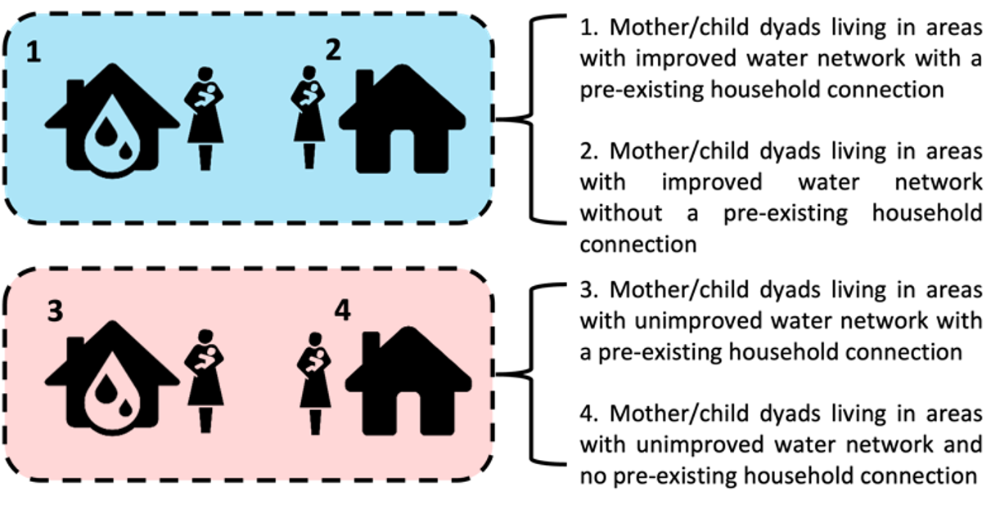

```{r setup, include=FALSE}
knitr::opts_chunk$set(echo = TRUE)
# rm(list = ls())

# Writing custom functions to render any table contents for continuous and categorical vars - keep these for any tables throughout
my.render.cont <- function(x) {
    with(stats.apply.rounding(stats.default(x), digits=2), c("",
        "Mean (SD)"=sprintf("%s (&plusmn; %s)", MEAN, SD)))
}
my.render.cat <- function(x) {
    c("", sapply(stats.default(x), function(y) with(y,
        sprintf("%d (%0.0f %%)", FREQ, PCT))))
}

```

# Introduction

**Aim 1**: to test how the provision of an improved piped water network impacts water access and quality. 

*Hypotheses*: I predict that a) individuals who live in neighborhoods with the improved piped water network and b) individuals who have a household connection to an improved water supply will have improved cwater quality and access compared to individuals who do not live in such a) neighborhoods or b) households.

The data for this analysis comes from the PAASIM “Pesquisa sobre o Acesso à Água e a Saúde Infantil em Moçambique” (PAASIM- Research on Access to Water and Child Health in Mozambique). The purpose of this project is to evaluate the impact of a new piped water network among informal settlements in the city of Beira using a matched control study design. A detailed description of the study protocol can be found here: https://bmjopen.bmj.com/content/13/3/e067341. The pre-specified analysis plan can be found here: https://osf.io/4rkn6/. 

```{r packages, message = F, results = F, warning = F}
# CREATE PACKAGE LIST:
Packages <- c("tidyverse", "knitr", "kableExtra", "readxl", "evaluate", "boot", "table1", "broom") 

# LOAD PACKAGES:
lapply(Packages, library, character.only = TRUE)

# SUPPRESS UNHELPFUL `dplyr` MESSAGES: 
options(dplyr.summarise.inform = FALSE)

```

**Packages used:**

`r Packages`

# Data

### Exposure
In brief, our intervention will be defined in two ways: 
* (1) People living in neighborhoods with the improved piped water network and 
* (2) individuals who have a household connection to an improved water supply. 



### Outcome 
We have water quality and access data from 548 households x 5 timepoints. Water quality will be defined by presence of *E. coli* (primary outcome), total coliforms, free and total chlorine, pressure, and enteropathogen data (from a subset of 100 households). We also have survey data that includes questions on satisfaction with water pressure, service, availability, and quality. Water access will be defined by the HWISE score, more information can be found here: https://www.ipr.northwestern.edu/wise-scales/measure-water-insecurity/. 

```{r data import, warning = FALSE}
# Remove the `Packages` variable from your environment
rm(Packages)

data <- read_excel("../../../../../../OneDrive-SharedLibraries-EmoryUniversity/Levy, Karen - 1. PAASIM/3. Data and Analysis/Data/Blinded dataset/Cleaned/PAASIM full cleaned data.xlsx")

# # doing some simple data exploration
# head(data)
# str(data)
# View(data)

```

## Data Formatting

I filtered the master dataset to only the variables that will be used in this analysis and only to visits from households that have completed the study (study_complete). I rename variables to assist with downstream analysis. I also include code for creating a fake intervention arm/variable to use in the analysis. When we are ready to unblind, I will delete this text and the code for the false intervention variable and will update the input data file to the unblinded dataset. 

I will use visit = 1 to create all baseline variables. I dropped visit = 0 as these were only if the mother wasn't 31 weeks pregnant. These data were just used to plan future enrollment visits. 

```{r data formatting}
# Create new dataset with variables used in this analysis
data_filt <- data %>%
  filter(study_complete == 1 & visit != 0) %>%
  select(main_id, visit, neighborhood, code, SES_score, high_poverty, san_basic_obs, fixed_emp_pri, secondary_complete, num_lt5, num_HH, months_in_hh, human_feces, animal_feces, HFIAS_score, HFIA_category, HW_dwell, season_rainy, flooding_HH_yard, ecolimpn_source, ecolimpn_stored, coliformmpn_source, coliformmpn_stored, C_10, water_service_ladder, improved_water, C_21, C_22, C_17, C_20, C_19, C_28_A1, C_28_A2, A_W_9, JMP_H2, C_4, C_23, C_18, O_W_7, O_W_8, C_12, LT30min, timeperweek, flow_rate, C_24, C_25, HWISE_scale, HWISE_insecure, M_1B, C_15_D, C_31, sub_SES_score, sub_density, sub_SES_tertile, sub_density_tertile, sub_density_strata, SES_score_bl) %>%
  rename(water_source = C_10, sat_color_appear = C_21, sat_taste_smell = C_22, sat_service = C_17, sat_pressure = C_20, sat_avail = C_19, storage_tank = C_28_A1, water_storage = A_W_9, water_HW = JMP_H2, share_FIPAG = C_4, sufficient_quant = C_23, sat_afford = C_18, free_chlor = O_W_7, total_chlor = O_W_8, collect_contin = C_12, avail_hr = C_24, avail_day = C_25, use_meter = M_1B, use_respond = C_15_D, child_consump = C_31)

# Create false intervention variable (will be deleted after unblinding)
matching_fake_arm <- read_excel("../../../../../../OneDrive-SharedLibraries-EmoryUniversity/Levy, Karen - 1. PAASIM/3. Data and Analysis/Data/Blinded dataset/matching_fake_arm.xlsx")

all_data <- merge(matching_fake_arm, data_filt, by = "code", all = TRUE)

# Checking visit numbers - there should be 642 for each visit
table(all_data$visit)

# cleanup
rm(data_filt, data, matching_fake_arm)

# Water storage 
table(all_data$water_storage)

# Water available at HW facility
table(all_data$water_HW)

# Sharing of drinking water connection 
table(all_data$share_FIPAG)

# Sufficient quantity of drinking water 
table(all_data$sufficient_quant)

# Distance of HH to water main 


# Distance of HH to drinking water source 


# Time to collect water (min)
summary(all_data$collect_contin)

# Piped water flow rate (L/min)
options(digits = 4)
summary(all_data$flow_rate) 

# Availability (hrs/day)
summary(all_data$avail_hr)

# Availability (days/week)
summary(all_data$avail_day)

# Water insecure households 
table(all_data$HWISE_insecure)

# Water usage (L/day) - meter
summary(all_data$use_meter)

# Water usage (L/day) - respondent 
summary(all_data$use_respond)

# Child consumption of drinking water source 
table(all_data$child_consump)
```

# Analysis

I briefly describe an outline of the planned analyses below. First, I will import and filter the data for variables that will be used in this analysis. I will univariately explore the associations between both levels of our intervention (household and neighborhood) and water quality and access. Following this, I will construct multivariate generalized estimating equations (GEE) to look at the association between both levels of the intervention and various water quality and access variables. 

* Table 1: Baseline differences in covariates of interest (neighborhood-level)
* Table 2: Baseline differences in covariates of interest (household-level)
* Table 3: Univariate analysis of water quality and access (neighborhood-level)
* Table 4: Univariate analysis of water quality and access (household-level)
* Table 5: Multivariate modeling of neighborhood-level intervention status and water quality and access 
* Figure 2: Plots associated with data from Table 5
* Table 6: Multivariate modeling of household-level intervention status and water quality and access 
* Figure 3: Plots associated with data from Table 6


## Data overview


## Table 1 - Baseline differences in covariates of interest (neighborhood-level)

Question - clarify with Josh that this table needs to be included because we are matching on the neighborhood-level characteristics so those vars would already be in the model

```{r table 1}

# Formatting
data_visit1 <- all_data %>%
  filter(visit == 1)

# Data Analysis

# Cleanup
# rm(insert removable objects here)

```

## Table 2 - Baseline differences in covariates of interest (household-level)

```{r}
# Formatting- exclude until after we run models

#data_visit1$san_basic_obs <- 
 # factor(data_visit1$san_basic_obs, levels=c(1,0),
  #       labels=c("Yes", 
   #               "No"))

#data_visit1$fixed_emp_pri <- 
 # factor(data_visit1$fixed_emp_pri, levels=c(1,0),
  #       labels=c("Yes", 
   #               "No"))

#data_visit1$human_feces <- 
 # factor(data_visit1$human_feces, levels=c(1,0),
  #       labels=c("Yes", 
   #               "No"))

#data_visit1$animal_feces <- 
 # factor(data_visit1$animal_feces, levels=c(1,0),
  #       labels=c("Yes", 
   #               "No"))

#data_visit1$HFIA_category <- 
 # factor(data_visit1$HFIA_category, levels=c(1,2,3,4),
  #       labels=c("Food secure", 
 #                 "Mildly food insecure",
  #                "Moderately food insecure",
   #               "Severely food insecure"))

#data_visit1$HW_dwell <- 
  #factor(data_visit1$HW_dwell, levels=c(1,0),
   #      labels=c("Yes", 
    #              "No"))

#data_visit1$season_rainy <- 
 # factor(data_visit1$season_rainy, levels=c(1,0),
  #       labels=c("Yes", 
   #             "No"))

#data_visit1$flooding_HH_yard <- 
 # factor(data_visit1$flooding_HH_yard, levels=c(1,0),
  #       labels=c("Yes", 
   #               "No"))

#data_visit1$fakearm <- 
 # factor(data_visit1$fakearm, levels=c(1,0),
  #       labels=c("Intervention", 
   #               "Control")) 

# Labeling vars - can edit this code later to make this code shorter 
label(data_visit1$SES_score) <- "SES Score"
label(data_visit1$num_lt5) <- "Number of children under 5 in household"
label(data_visit1$num_HH) <- "Number of people in household"
label(data_visit1$months_in_hh) <- "Months living in household"
label(data_visit1$san_basic_obs) <- "Basic sanitation access"
label(data_visit1$fixed_emp_pri) <- "Fixed employment status of primary wage earner"
label(data_visit1$human_feces) <- "Observed human feces in or near the household"
label(data_visit1$animal_feces) <- "Observed animal feces in or near the household"
label(data_visit1$HFIA_category) <- "Household Food Insecurity Access Scale (categorized)"
label(data_visit1$HW_dwell) <- "Handwashing station (with soap and water) in house or yard"
label(data_visit1$season_rainy) <- "Rainy season (Dec-Apr)"
label(data_visit1$flooding_HH_yard) <- "Any flooding in household or yard in the last month"
label(data_visit1$fakearm) <- "FIPAG connection at household"

caption <- "Table 2. Baseline differences in covariates of interest based household-intervention status"
# footnote <- "ᵃ example footnote here"

# Data Analysis

# Create Table 1
table1(~ SES_score + num_lt5 + num_HH + months_in_hh + san_basic_obs + fixed_emp_pri + human_feces + animal_feces + HFIA_category + HW_dwell + season_rainy + flooding_HH_yard | fakearm, data = data_visit1, caption = caption,  render.continuous=my.render.cont, render.categorical=my.render.cat) # Add in footnote = footnote if applicable

# RR for continuous variables 
continuous_vars <- c("SES_score", "num_lt5", "num_HH", "months_in_hh")
categorical_vars<- c("san_basic_obs", "fixed_emp_pri", "human_feces", "animal_feces", "HFIA_category", "HW_dwell", "season_rainy", "flooding_HH_yard")

# Function for continuous variables using linear regression 
calculate_rr_continuous <- function(data, group_var, continuous_var) {
  model <- lm(continuous_var ~ get(group_var), data = data)
  coef_val <- exp(coef(model)[2])  # Extract coefficient for the group variable and exponentiate
  p_val <- summary(model)$coefficients[2, 4]  # Extract p-value
  return(c(Risk_Ratio = coef_val, p_value = p_val))
}

# Loop function over all continuous variables
rr_continuous <- lapply(continuous_vars, function(var) {
  calculate_rr_continuous(data = data_visit1, group_var = "fakearm", continuous_var = data_visit1[[var]])
})

print(rr_continuous)

# Function for categorical variables using Poisson regression 
calculate_rr_categorical <- function(data, group_var, categorical_var) {
  model <- glm(categorical_var ~ get(group_var), data = data, family = poisson)
  coef_val <- exp(coef(model)[2])  # Extract coefficient for the group variable and exponentiate
  p_val <- summary(model)$coefficients[2, 4]  # Extract p-value
  return(c(Risk_Ratio = coef_val, p_value = p_val))
}

# Loop function over all categorical variables
rr_categorical <- lapply(categorical_vars, function(var) {
  calculate_rr_categorical(data = data_visit1, group_var = "fakearm", categorical_var = data_visit1[[var]])
})

print(rr_categorical)

# Cleanup
rm(caption)
```

## Table 3 - Univariate association between intervention with water quality and access  (neighborhood-level)
```{r}
# Formatting

# Data Analysis 

## Categorical Vars 
### FIB Categorical
### Enteropathogens (P/A) - don't have this data yet
### Satisfied with water color and appearance
### Satisfied with water taste and smell 
### Satisfied with water service
### Satisfied with water pressure 
### Satisfied with water availability 
### Water Storage (Y/N) 
### Water available at handwashing facility 
### Water available at latrine 
### Sharing of drinking water connection 
### Sufficient quantity of drinking water 
### Satisfied with water affordability 
### Child consumption of drinking water 
### Water insecure
### HWISE scale

## Continuous Vars
### Linear regression function 
run_linear_regression <- function(data, predictor, responses) {
  results <- map_dfr(responses, function(response) {
    # Fit linear regression model
    model <- lm(paste(response, "~", predictor), data = data)
    
    # Extract coefficients
    coefficients <- tidy(model)
    
    # Add predictor and response variable names
    coefficients$Predictor <- predictor
    coefficients$Response <- response
    
    return(coefficients)
  })
  
  # Format the results as a table
  results_table <- results %>%
    pivot_wider(names_from = Response, values_from = c(estimate, std.error)) %>%
    rename_with(~paste(., "Estimate", sep = "_"), contains("estimate")) %>%
    rename_with(~paste(., "Std. Error", sep = "_"), contains("std.error")) %>%
    select(-term)
  
  return(results_table)
}

# List of continuous outcome vars- need to add distance variables (hh to water main and hh to water source)
predictor <- "fakearm"
responses <- c("ecolimpn_stored", "ecolimpn_source", "coliformmpn_stored", "coliformmpn_source", "free_chlor", "total_chlor", "collect_contin", "timeperweek", "flow_rate", "avail_hr", "avail_day", "use_meter", "use_respond")

results_univariate_continuous <- run_linear_regression(all_data, predictor, responses)
kable(results_univariate_continuous)

# Cleanup
# rm(insert removable objects here)
```

## Table 4 - Univariate association between intervention with water quality and access (household-level)
```{r}
# Formatting

# Data Analysis 

# Cleanup
# rm(insert removable objects here)
```

## Table 5 - Multivariate association between intervention with water quality and access (neighborhood-level)

### Model Construction (Table 5)
```{r model construction table 5}

```

### Model Validation (Table 5)

```{r model validation table 5}

# (for GLMMs, we typically use the `DHARMa` package for this, e.g.
# replace "my.model" with the name of the model you are assessing
# and probably change the name "sim.out.my.model" to something more descriptive)
# simulate residuals using DHARMa:
sim.out.my.model <- simulateResiduals(fittedModel = my.model, plot = F)
plot(sim.out.my.model) # plot residual plots
testDispersion(sim.out.my.model, plot = F) # print dispersion results
testZeroInflation(sim.out.my.model, plot = F) # print zero-inflation results

# CLEANUP
# again, remove anything that isn't subsequently used in the analysis
rm(sim.out.my.model)

```

### Plots (Table 5) 
```{r plot table 5}

# any data preparation / summarization needed for plotting
# code below is just a placeholder!
myplotdata = mydata %>% group_by(mygroupingvar1, mygroupingvar1) %>% 
  summarize(mean = mean(), stdev = sd()...) 

# create the actual plot (almost always using `ggplot2`)
myplot = ggplot(myplotdata, ...)

# DISPLAY the plot in your Rmarkdown report 
# (usually just a single line of code, 
# the name of the ggplot object you created above)
myplot

# SAVE PLOT
# example, but key thing is the `plots/` prefix in the file path
ggsave(myplot, file = "plots/myplot.pdf", width = 5, height = 3)

# # CLEANUP
# # remember to also clean up any objects such as data summarizations
# # set up for your plotting, e.g.:
rm(myplotdata, myplot)

```

## Table 6 - Multivariate association between intervention with water quality and access (household-level)

### Model Construction (Table 6)
```{r model construction table 6}

```

### Model Validation (Table 6)

```{r model validation table 6}

# (for GLMMs, we typically use the `DHARMa` package for this, e.g.
# replace "my.model" with the name of the model you are assessing
# and probably change the name "sim.out.my.model" to something more descriptive)
# simulate residuals using DHARMa:
sim.out.my.model <- simulateResiduals(fittedModel = my.model, plot = F)
plot(sim.out.my.model) # plot residual plots
testDispersion(sim.out.my.model, plot = F) # print dispersion results
testZeroInflation(sim.out.my.model, plot = F) # print zero-inflation results

# CLEANUP
# again, remove anything that isn't subsequently used in the analysis
rm(sim.out.my.model)

```

### Plots (Table 6) 
```{r plot table 6}

# any data preparation / summarization needed for plotting
# code below is just a placeholder!
myplotdata = mydata %>% group_by(mygroupingvar1, mygroupingvar1) %>% 
  summarize(mean = mean(), stdev = sd()...) 

# create the actual plot (almost always using `ggplot2`)
myplot = ggplot(myplotdata, ...)

# DISPLAY the plot in your Rmarkdown report 
# (usually just a single line of code, 
# the name of the ggplot object you created above)
myplot

# SAVE PLOT
# example, but key thing is the `plots/` prefix in the file path
ggsave(myplot, file = "plots/myplot.pdf", width = 5, height = 3)

# # CLEANUP
# # remember to also clean up any objects such as data summarizations
# # set up for your plotting, e.g.:
rm(myplotdata, myplot)

```

# Session Info

```{r Session Info}
sessionInfo()
```

