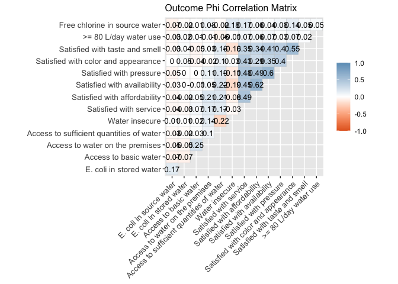
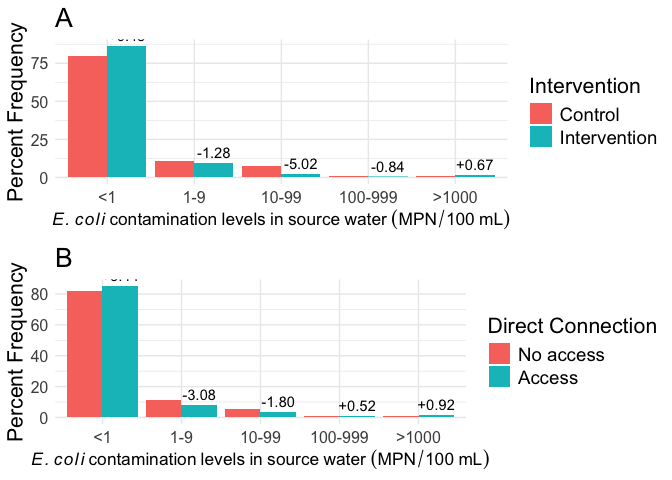
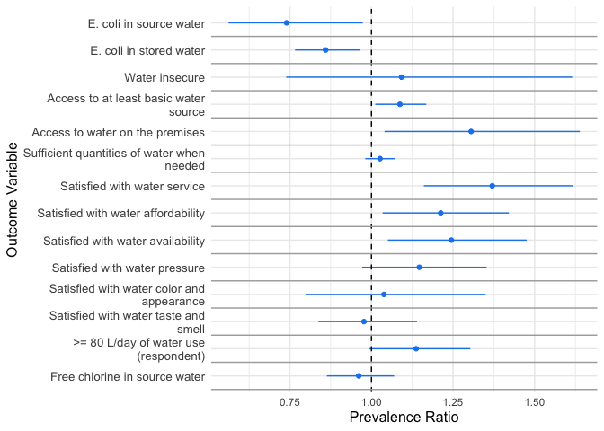
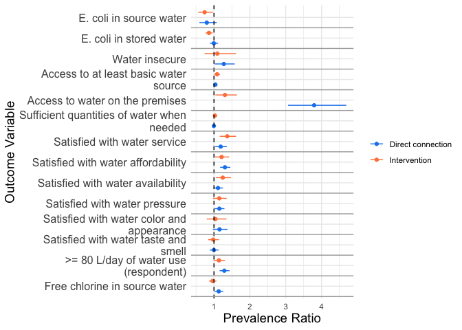
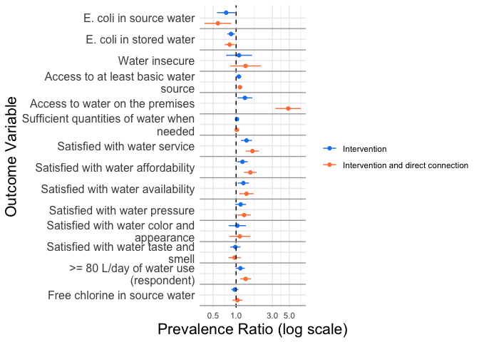

# Introduction

**Aim 1**: to test how the provision of an improved piped water network impacts water access and quality. 

*Hypotheses*: I predict that a) individuals who live in neighborhoods with the improved piped water network and b) individuals who have a household connection to an improved water supply will have improved cwater quality and access compared to individuals who do not live in such a) neighborhoods or b) households.

The data for this analysis comes from the PAASIM “Pesquisa sobre o Acesso à Água e a Saúde Infantil em Moçambique” (PAASIM- Research on Access to Water and Child Health in Mozambique). The purpose of this project is to evaluate the impact of a new piped water network among informal settlements in the city of Beira using a matched control study design. A detailed description of the study protocol can be found here: https://bmjopen.bmj.com/content/13/3/e067341. The pre-specified analysis plan can be found here: https://osf.io/4rkn6/. 


``` r
# Create package list
Packages <- c("tidyverse", "knitr", "kableExtra", "readxl", "evaluate", "boot", "table1", "broom", "flextable", "gee", "purrr", "glmtoolbox", "MatchIt", "gridExtra", "ggcorrplot", "lme4", "performance", "RColorBrewer") 

# Load packages
lapply(Packages, library, character.only = TRUE)

# Suppress dplyr messages
options(dplyr.summarise.inform = FALSE)
```

**Packages used:**

tidyverse, knitr, kableExtra, readxl, evaluate, boot, table1, broom, flextable, gee, purrr, glmtoolbox, MatchIt, gridExtra, ggcorrplot, lme4, performance, RColorBrewer

# Data

### Exposure
In brief, our intervention will be defined in two ways: 
* (1) People living in neighborhoods with the improved piped water network (Intervention) and 
* (2) individuals who have a household (HH) connection to an improved water supply (direct connection). 


### Outcome 
We have water quality and access data from 548 households x 5 timepoints. Water quality will be defined by presence of *E. coli* in source (primary outcome) and stored water, free chlorine, and pressure. We also have survey data that includes questions on water access, water usage, water source, and satisfaction with water pressure, service, availability, and quality. Water access will be defined by the HWISE score, more information can be found here: https://www.ipr.northwestern.edu/wise-scales/measure-water-insecurity/. 

We first analyze all exposure/outcome relationships at the 12-month timepoint and follow this analysis with an analysis across all timepoints.


``` r
# Read in data
data <- read_csv("../../../../../../OneDrive-SharedLibraries-Emory/Levy, Karen - 1. PAASIM/3. Data and Analysis/Data/Blinded dataset/Cleaned/PAASIM full cleaned data.csv")
```

```
## New names:
## Rows: 4251 Columns: 731
## ── Column specification
## ──────────────────────────────────────────────────────── Delimiter: "," chr
## (36): visitID, child_death, B_7, B_7_other, F_19, F_34_other, C_11_oth... dbl
## (662): ...1, main_id, visit, sample_round, arm, final_match_strata_3, h... lgl
## (13): arm_changed, hh_A_1_4_other, C_10_other, C_30_other, J_50, J_51,... dttm
## (1): EDD_calc date (19): hh_date, birthdate, eligible_3a, A_4, B_4,
## F_r_pr_date, fec_proc...
## ℹ Use `spec()` to retrieve the full column specification for this data. ℹ
## Specify the column types or set `show_col_types = FALSE` to quiet this message.
## • `` -> `...1`
```

## Data Formatting

I filter the master dataset to only the variables that will be used in this analysis and only to visits from households that have completed the study (study_complete). I rename variables to assist with downstream analysis. I also merge the intervention arm and matching data. 

I use visit = 1 to create all baseline variables. I dropped visit = 0 as these were only if the mother wasn't 31 weeks pregnant. These data were just used to plan future enrollment visits. 


``` r
# Create smaller dataset with variables used in this analysis
data_filt <- data %>%
  dplyr::filter(study_complete == 1 & visit != 0) %>%
  dplyr::select(main_id, visit, neighborhood, code, SES_score_bl, high_poverty, san_basic_obs_bl, fixed_emp_pri, secondary_complete_bl, num_lt5, num_HH, months_in_hh, human_feces, animal_feces, HFIAS_score, HFIA_category, HW_dwell, season_rainy, flooding_HH_yard, ecolimpn_source, ecolimpn_stored, coliformmpn_source, coliformmpn_stored, C_10, water_service_ladder, improved_water, C_21, C_22, C_17, C_20, C_19, C_28_A1, C_28_A2, A_W_9, JMP_H2, C_4, C_23, C_18, O_W_7, O_W_8, C_12, LT30min, timeperweek, flow_rate, C_24, C_25, HWISE_insecure_new, M_1B, C_15_D, C_31, sub_SES_score, sub_density, sub_SES_tertile, sub_density_tertile, sub_density_strata, SES_score_bl, ecoli_bin_source, ecoli_bin_stored, basic_water, onpremises, sufficient, C_17_bin, C_18_bin, C_19_bin, C_20_bin, C_21_bin, C_22_bin, C_1, C_2, ecolimpn_source_cat, ecolimpn_stored_cat, san_basic_obs_bl, D_1, D_2, D_3, D_4, D_5, D_6, D_7, D_8, D_9, D_10, D_11, D_12, hh_date, C_24,crossover, free_chlor_WHO) %>%
  rename(water_source = C_10, sat_color_appear = C_21, sat_taste_smell = C_22, sat_service = C_17, sat_pressure = C_20, sat_avail = C_19, storage_tank = C_28_A1, water_storage = A_W_9, water_HW = JMP_H2, share_FIPAG = C_4, sufficient_quant = C_23, sat_afford = C_18, free_chlor = O_W_7, total_chlor = O_W_8, collect_contin = C_12, avail_hr = C_24, avail_day = C_25, use_meter = M_1B, use_respond = C_15_D, child_consump = C_31, always_sat_service = C_17_bin, always_sat_afford = C_18_bin, always_sat_avail = C_19_bin, always_sat_pressure = C_20_bin, always_sat_appear = C_21_bin, always_sat_taste = C_22_bin)

# Add in intervention variable- saved locally for blinding purposes.
matching_arm <- read_excel("/Users/cmpoulo/Desktop/matching_arm.xlsx")

## Merge with large data set by sub-neighborhood 'code' ID
all_data <- merge(matching_arm, data_filt, by = "code", all = TRUE)

# Create direct connection variable (an active FIPAG HH connection)
all_data$hh_water <- ifelse(all_data$C_1 == 1 & (all_data$C_2 == 1 | all_data$C_2 == 2), 1, 0)

# Categorizing 'use_respond' variable (participant reported water use in liters per day)
## Get summary
summary(all_data$use_respond)

## categorize by median value of 80 L/day (non-normally distributed)
all_data <- all_data %>%
  mutate(use_respond_bin = ifelse(use_respond >= 80, 1, 0))

# Clean up 
rm(data_filt, data, matching_arm, Packages)
```

# Impact of the intervention and association with direct connection on water quality and access

I briefly describe an outline of the planned analyses below. Our pre-analysis plan with further details can be found at: https://osf.io/4rkn6/

* Supplemental Figure 2: Correlation between outcome variables 
* Table 1a: Baseline differences in covariates of interest by intervention status (Table 1 in manuscript)
* Table 1b: Baseline differences in covariates of interest by direct HH connection status (Table 1 in manuscript)
* Figure 2: Source E.coli categories at 12-months by intervention status (intervention and direct HH connection)
* Supplemental Table 2: Impact of intervention on water quality and access (12-months)
* Table 2. Impact of the intervention on water quality and access variables (all timepoints)
* Supplemental Table 3: Association between direct HH connection and water quality and access variables (12-months)
* Table 3: Association between having a direct connection and water quality and access variables (all timepoints) 
* Supplemental Table 4: Characteristics of study participants stratified by combined intervention status
* Supplemental table 5: Evaluation of interaction between intervention and direct HH connection status on water quality and access variables 
* Figure 3: Plot model results from table 2b and supplemental table 5


## Supplemental Figure 1: Frequency and correlation tables for outcomes of interest 

``` r
# Outcome list 
## Make sure all variables are correctly classified as character for the frequency tables
character_vars <- c("arm", "final_match_strata_3", "san_basic_obs_bl", "secondary_complete_bl", "ecoli_bin_source", "ecoli_bin_stored", "basic_water", "onpremises", "sufficient", "HWISE_insecure_new", "always_sat_service", "always_sat_afford", "always_sat_avail", "always_sat_pressure", "always_sat_appear", "always_sat_taste", "use_respond_bin", "hh_water", "free_chlor_WHO")

all_data_freq <- all_data %>%
  dplyr::mutate(across(all_of(character_vars), as.character))

# Create correlation tables 
## Make sure all variables are classified as numeric for the correlation plot 
numeric_vars <- c("ecoli_bin_source", "ecoli_bin_stored", "basic_water", "onpremises", "sufficient", "HWISE_insecure_new", "always_sat_service", "always_sat_afford", "always_sat_avail", "always_sat_pressure", "always_sat_appear", "always_sat_taste", "use_respond_bin", "free_chlor_WHO")
## Make all variables numeric
all_data_num <- all_data %>%
  dplyr::mutate(across(all_of(numeric_vars), as.numeric))

phi_matrix <- cor(all_data_num[numeric_vars], use = "complete.obs")

# Format row and column names for correlation plot
colnames(phi_matrix) <- c("E. coli in source water", "E. coli in stored water", "Access to basic water", "Access to water on the premises", "Access to sufficient quantities of water", "Water insecure", "Satisfied with service", "Satisfied with affordability", "Satisfied with availability", "Satisfied with pressure", "Satisfied with color and appearance", "Satisfied with taste and smell", ">= 80 L/day water use", "Free chlorine in source water")
rownames(phi_matrix) <- c("E. coli in source water", "E. coli in stored water", "Access to basic water", "Access to water on the premises", "Access to sufficient quantities of water", "Water insecure", "Satisfied with service", "Satisfied with affordability", "Satisfied with availability", "Satisfied with pressure", "Satisfied with color and appearance", "Satisfied with taste and smell", ">= 80 L/day water use", "Free chlorine in source water")

# Create correlation plot 
outcome_correlations <- ggcorrplot(phi_matrix, 
           type = "upper",         
           lab = TRUE,            
           lab_size = 3.5,      
           colors = c("#E46726","white", "#6D9EC1"), 
           legend.title = NULL,
           title = "Outcome Phi Correlation Matrix",       
           ggtheme = ggplot2::theme_gray + 
             theme(
               axis.text.x = element_text(size = 6),   # Adjust font size for x-axis labels
               axis.text.y = element_text(size = 6)    # Adjust font size for y-axis labels
             ))

outcome_correlations <- outcome_correlations +
theme(
    axis.text.x = element_text(size = 10),   # Adjust font size for x-axis labels
    axis.text.y = element_text(size = 10),   # Adjust font size for y-axis labels
    plot.title = element_text(size = 12)    # Adjust font size for plot title
  )

outcome_correlations
```

<!-- -->

``` r
# Save plot
ggsave("plots/Supplemental Figure 1. Correlation between outcome variables.png", outcome_correlations, height = 7, width = 10)

# Cleanup
rm(phi_matrix, all_data_num, outcome_correlations, numeric_vars)
```

## Outcome frequency data for table 2 and supplemental table 2 (intervention)

``` r
# Filter out crossover households (only for intervention analysis)
all_data_network <- all_data %>%
  filter(crossover == 0)

# Create list of outcome variables
variables <- c("ecoli_bin_source", "ecoli_bin_stored", "basic_water", "onpremises", "sufficient", "HWISE_insecure_new", "always_sat_service", "always_sat_afford", "always_sat_avail", "always_sat_pressure", "always_sat_appear", "always_sat_taste", "use_respond_bin", "free_chlor_WHO")

# Frequency table for intervention (all timepoints)
result_list <- frequency_tables_for_vars(all_data_network, variables, "arm")
combined_results <- bind_rows(result_list)

table2_freq <- combined_results %>%
  filter(variable_value == 1)

# Frequency table at visit 5 (12-months) only 
network_visit5 <- all_data_network %>%
  filter(visit == 5)

result_list <- frequency_tables_for_vars(network_visit5, variables, "arm")
combined_results <- bind_rows(result_list)

supp_table2_freq <- combined_results %>%
  filter(variable_value == 1)
```


Table: Frequency outcome data for supplemental table 2 (intervention at 12-months)

|variable            | arm| variable_value| count| percentage|
|:-------------------|---:|--------------:|-----:|----------:|
|ecoli_bin_source    |   0|              1|    50|   20.16129|
|ecoli_bin_source    |   1|              1|    37|   13.60294|
|ecoli_bin_stored    |   0|              1|   150|   49.66887|
|ecoli_bin_stored    |   1|              1|   147|   49.32886|
|basic_water         |   0|              1|   278|   89.96764|
|basic_water         |   1|              1|   295|   97.68212|
|onpremises          |   0|              1|   124|   40.12945|
|onpremises          |   1|              1|   171|   56.62252|
|sufficient          |   0|              1|   290|   93.85113|
|sufficient          |   1|              1|   284|   94.03974|
|HWISE_insecure_new  |   0|              1|    24|    7.76699|
|HWISE_insecure_new  |   1|              1|    63|   21.28378|
|always_sat_service  |   0|              1|    85|   27.50809|
|always_sat_service  |   1|              1|   141|   46.84385|
|always_sat_afford   |   0|              1|   157|   51.14007|
|always_sat_afford   |   1|              1|   200|   66.66667|
|always_sat_avail    |   0|              1|   141|   45.63107|
|always_sat_avail    |   1|              1|   173|   57.28477|
|always_sat_pressure |   0|              1|   131|   42.39482|
|always_sat_pressure |   1|              1|   157|   52.15947|
|always_sat_appear   |   0|              1|    62|   20.06472|
|always_sat_appear   |   1|              1|    87|   28.80795|
|always_sat_taste    |   0|              1|   119|   38.51133|
|always_sat_taste    |   1|              1|   142|   47.01987|
|use_respond_bin     |   0|              1|   182|   58.89968|
|use_respond_bin     |   1|              1|   195|   64.56954|
|free_chlor_WHO      |   0|              1|   130|   54.62185|
|free_chlor_WHO      |   1|              1|   160|   59.47955|


Table: Frequency outcome data for table 2 (intervention across all timepoints)

|variable            | arm| variable_value| count| percentage|
|:-------------------|---:|--------------:|-----:|----------:|
|ecoli_bin_source    |   0|              1|   198|   15.30139|
|ecoli_bin_source    |   1|              1|   170|   12.35465|
|ecoli_bin_stored    |   0|              1|   725|   47.76021|
|ecoli_bin_stored    |   1|              1|   652|   43.78778|
|basic_water         |   0|              1|  1394|   90.34349|
|basic_water         |   1|              1|  1474|   97.74536|
|onpremises          |   0|              1|   677|   43.81877|
|onpremises          |   1|              1|   892|   59.11199|
|sufficient          |   0|              1|  1346|   87.11974|
|sufficient          |   1|              1|  1296|   86.05578|
|HWISE_insecure_new  |   0|              1|   247|   16.13325|
|HWISE_insecure_new  |   1|              1|   331|   22.27456|
|always_sat_service  |   0|              1|   653|   42.37508|
|always_sat_service  |   1|              1|   899|   59.69456|
|always_sat_afford   |   0|              1|   899|   58.56678|
|always_sat_afford   |   1|              1|  1058|   70.48634|
|always_sat_avail    |   0|              1|   827|   53.52751|
|always_sat_avail    |   1|              1|   951|   63.06366|
|always_sat_pressure |   0|              1|   805|   52.51142|
|always_sat_pressure |   1|              1|   900|   60.16043|
|always_sat_appear   |   0|              1|   397|   25.71244|
|always_sat_appear   |   1|              1|   433|   28.73258|
|always_sat_taste    |   0|              1|   668|   43.23625|
|always_sat_taste    |   1|              1|   690|   45.87766|
|use_respond_bin     |   0|              1|   857|   55.46926|
|use_respond_bin     |   1|              1|   937|   62.09410|
|free_chlor_WHO      |   0|              1|   795|   62.10938|
|free_chlor_WHO      |   1|              1|   889|   64.79592|


## Outcome frequency data for supplemental table 3 and table 3 (direct connection)

``` r
# Remove NA values for hh_water but keep crossover households
all_data_freq <- all_data %>%
  filter(!is.na(hh_water))

result_list <- frequency_tables_for_vars(all_data_freq, variables, "hh_water")
combined_results <- bind_rows(result_list)

table3_freq <- combined_results %>%
  filter(variable_value == 1)

# Frequency table at visit 5 only 
all_data_freq_visit5 <- all_data_freq %>%
  filter(visit == 5)

result_list <- frequency_tables_for_vars(all_data_freq_visit5, variables, "hh_water")
combined_results <- bind_rows(result_list)

supp_table3_freq <- combined_results %>%
  filter(variable_value == 1)

# Cleanup
rm(all_data_freq, all_data_freq_visit5, combined_results, result_list, variables)
```

## Table 1a -  Differences in covariates of interest at enrollment (intervention)

``` r
# Formatting
## Filter to enrollment timepoint
data_visit1 <- all_data %>%
  filter(visit == 1)

## filter out crossover households
data_visit1_network <- data_visit1 %>%
  filter(crossover== 0)

# Make variable lists
variables <- c("secondary_complete_bl", "san_basic_obs_bl", "fixed_emp_pri", "human_feces", "animal_feces", "HW_dwell", "season_rainy", "flooding_HH_yard", "high_poverty")

continuous_variables <- c("num_lt5", "num_HH", "months_in_hh", "HFIAS_score", "avail_hr")

# Network enrollment table for binary vars
result_list <- frequency_tables_for_vars(data_visit1_network, variables, "arm")
combined_results <- bind_rows(result_list)

table1a <- combined_results %>%
  filter(variable_value == 1)

# Repeat for continuous variables 
result_list_continuous <- summary_statistics_for_vars(data_visit1_network, continuous_variables, "arm")
table1a_continuous <- bind_rows(result_list_continuous)

# Save tables
write.csv(table1a, "results/Table 1a. Differences in covariates of interest at enrollment by intervention status (binary).csv")
write.csv(table1a_continuous, "results/Table 1a. Differences in covariates of interest at enrollment by intervention status (continuous).csv")
```

Based on the table above, we need to control for months living in household and fixed employment of primary caregiver in addition to pre-specified covariates (high poverty, san_basic_obs_bl, secondary_complete_bl). 

## Table 1b - Baseline differences in covariates of interest (direct connection)

``` r
# HH enrollment table for factor vars
result_list <- frequency_tables_for_vars(data_visit1, variables, "hh_water")
combined_results <- bind_rows(result_list)

table1b <- combined_results %>%
  filter(variable_value == 1)

# Repeat for continuous variables 
result_list_continuous <- summary_statistics_for_vars(data_visit1, continuous_variables, "hh_water")
table1b_continuous <- bind_rows(result_list_continuous)

# Save tables
write.csv(table1b, "results/Table 1b. Differences in covariates of interest at enrollment by direct HH connection status (binary).csv")
write.csv(table1b_continuous, "results/Table 1b. Differences in covariates of interest at enrollment by direct HH connection status (continuous).csv")

# Cleanup
rm(combined_results, data_visit1, data_visit1_network, result_list, result_list_continuous, continuous_variables, variables)
```

For Direct connection effect models, I need to control for months living in HH, fixed employment of primary wage earner, and any flooding in HH or yard in the past month in addition to pre-specified covariates. We will not control for HW station in dwelling or yard with soap and water because this is likely downstream from the exposure. 

## Figure 2. Source E.coli prevalence categories by intervention status at 12-months (intervention and direct connection)

``` r
# Figure 2 Panel A (Intervention)
all_data_figure2 <- all_data %>%
  filter(visit == 5)

## remove NA values
all_data_figure2 <- all_data_figure2[!is.na(all_data_figure2$ecolimpn_source_cat), ]

all_data_figure2 <- all_data_figure2 %>%
  mutate(arm = factor(arm, labels = c("Control", "Intervention")))

all_data_figure2$ecolimpn_source_cat <- factor(all_data_figure2$ecolimpn_source_cat, 
                                               labels = c("<1", "1-9", "10-99", "100-999", ">1000"),
                                               levels = c("-1", "0", "1", "2", "3"))

# Remove crossover households from the intervention panel
all_data_figure2_network <- all_data_figure2 %>%
  filter(crossover == 0)

all_data_figure2_network <- all_data_figure2_network %>%
  group_by(arm, ecolimpn_source_cat) %>%
  summarise(count = n()) %>%
  mutate(percent = count / sum(count) * 100) 


all_data_figure2_network <- all_data_figure2_network %>%
  mutate(label = case_when(
    arm == "Intervention" & ecolimpn_source_cat == "<1" ~ "+6.48",
    arm == "Intervention" & ecolimpn_source_cat == "1-9" ~ "-1.28",
    arm == "Intervention" & ecolimpn_source_cat == "10-99" ~ "-5.02",
    arm == "Intervention" & ecolimpn_source_cat == "100-999" ~ "-0.84",
    arm == "Intervention" & ecolimpn_source_cat == ">1000" ~ "+0.67",
    TRUE ~ NA_character_
  ))

figure2a <- ggplot(all_data_figure2_network, aes(x = ecolimpn_source_cat, y = percent, fill = arm)) +
  geom_bar(position = "dodge", stat = "identity") +
  labs(
    title = "A",
    x = expression(italic(E.~coli)~contamination~levels~`in`~source~water~(MPN/`100`~mL)),
    y = "Percent Frequency",
    fill = "Intervention"
  ) +
  theme_minimal() +
  geom_text(aes(label = label), position = position_dodge(width = 0.9), vjust = -0.5) +
 theme(
    plot.title = element_text(size = 20),        # Adjust the plot title size
    axis.title.x = element_text(size = 13),      # Adjust the x-axis title size
    axis.title.y = element_text(size = 16),      # Adjust the y-axis title size
    axis.text.x = element_text(size = 12),       # Adjust the x-axis text size
    axis.text.y = element_text(size = 12),       # Adjust the y-axis text size
    legend.title = element_text(size = 16),      # Adjust the legend title size
    legend.text = element_text(size = 14)        # Adjust the legend text size
  )


# Figure 2 Panel B
all_data_figure2 <- all_data %>%
  filter(visit == 5)

all_data_figure2 <- all_data_figure2 %>%
  filter(!is.na(ecolimpn_source_cat) & !is.na(hh_water))

all_data_figure2 <- all_data_figure2 %>%
  mutate(hh_water = factor(hh_water, labels = c("No access", "Access")))

all_data_figure2$ecolimpn_source_cat <- factor(all_data_figure2$ecolimpn_source_cat, 
                                               labels = c("<1", "1-9", "10-99", "100-999", ">1000"),
                                               levels = c("-1", "0", "1", "2", "3"))

all_data_figure2 <- all_data_figure2 %>%
  group_by(hh_water, ecolimpn_source_cat) %>%
  summarise(count = n()) %>%
  mutate(percent = count / sum(count) * 100)

all_data_figure2 <- all_data_figure2 %>%
  mutate(label = case_when(
    hh_water == "Access" & ecolimpn_source_cat == "<1" ~ "+3.44",
    hh_water == "Access" & ecolimpn_source_cat == "1-9" ~ "-3.08",
    hh_water == "Access" & ecolimpn_source_cat == "10-99" ~ "-1.80",
    hh_water == "Access" & ecolimpn_source_cat == "100-999" ~ "+0.52",
    hh_water == "Access" & ecolimpn_source_cat == ">1000" ~ "+0.92",
    TRUE ~ NA_character_
  ))

figure2b <- ggplot(all_data_figure2, aes(x = ecolimpn_source_cat, y = percent, fill = hh_water)) +
  geom_bar(position = "dodge", stat = "identity") +
  labs(
    title = "B",
    x = expression(italic(E.~coli)~contamination~levels~`in`~source~water~(MPN/`100`~mL)),
    y = "Percent Frequency",
    fill = "Direct Connection"
  ) +
  theme_minimal() +
  geom_text(aes(label = label), position = position_dodge(width = 0.9), vjust = -0.5)+
 theme(
    plot.title = element_text(size = 20),        # Adjust the plot title size
    axis.title.x = element_text(size = 13),      # Adjust the x-axis title size
    axis.title.y = element_text(size = 16),      # Adjust the y-axis title size
    axis.text.x = element_text(size = 12),       # Adjust the x-axis text size
    axis.text.y = element_text(size = 12),       # Adjust the y-axis text size
    legend.title = element_text(size = 16),      # Adjust the legend title size
    legend.text = element_text(size = 14)        # Adjust the legend text size
  )


figure2 <- grid.arrange(figure2a, figure2b, ncol= 1)
```

```
## Warning: Removed 5 rows containing missing values or values outside the scale range
## (`geom_text()`).
## Removed 5 rows containing missing values or values outside the scale range
## (`geom_text()`).
```

<!-- -->

``` r
ggsave("plots/Figure 2. E. coli category by intervention status.png", figure2, width = 8, height = 12)

# Cleanup
rm(all_data_figure2, figure2a, figure2b, all_data_figure2_network)
```

## Multivariate association between intervention with water quality and access 
Using intent-to-treat (ITT)- like analysis which means that we will compare outcomes based on whether the participant lives in the intervention neighborhood regardless of their use of the intervention. We use the variable 'code' to indicate the study cluster. We account for matching by including the matching strata in each model. 

**Outcome Variables**: prevalence of detectable E. coli in source water [primary], prevalence of detectable E. coli in stored water, prevalence of at least *basic* water source, prevalence of water that is accessible on premises, prevalence of households with sufficient quantities of drinking water when needed, prevalence of household with HWISE score of >=12 (water_insecure), prevalence of always being satisfied with 1) service, 2) affordability, 3) availability, 4) pressure, 5) appearance, 6) smell, prevalence of WHO-recommended free chlorine levels


``` r
# Arrange by code 
all_data <- all_data %>%
  arrange(code)

# Make sure visit and final_match_strata_3 are factor
all_data$visit <- as.factor(all_data$visit)
all_data$final_match_strata_3 <- as.factor(all_data$final_match_strata_3)
```

### Supplemental Table 2. Impact of intervention on water quality and acccess (12 months)

``` r
# Subset to visit 5 and no crossover households
all_data_network_visit5 <- all_data %>%
  filter(visit == 5 & crossover == 0)

# Make sure dataset is ordered by code for GEE models
all_data_network_visit5 <- all_data_network_visit5 %>%
  arrange(code)

# Run models
# Prev. of E. coli in source water 
## Unadjusted 
model_formula <- ecoli_bin_source ~ arm 
extract <- extract_summary_pois(model_formula, "E. coli in source water", all_data_network_visit5)
result_prevecoli_unadjusted <- extract$result_df

## Adjusted
model_formula <- ecoli_bin_source ~ arm + high_poverty + san_basic_obs_bl + secondary_complete_bl + final_match_strata_3 + months_in_hh + fixed_emp_pri
extract <- extract_summary_pois(model_formula, "E. coli in source water", all_data_network_visit5)
result_prevecoli <- extract$result_df

# Prev. of E. coli in stored water
## Unadjusted 
model_formula <- ecoli_bin_stored ~ arm 
extract <- extract_summary_pois(model_formula, "E. coli in stored water", all_data_network_visit5)
result_prevecoli_stored_unadjusted <- extract$result_df

## Adjusted- prev ecoli in stored water
model_formula <- ecoli_bin_stored ~ arm + high_poverty + san_basic_obs_bl + secondary_complete_bl + final_match_strata_3 + months_in_hh  + fixed_emp_pri 
extract <- extract_summary_pois(model_formula, "E. coli in stored water", all_data_network_visit5)
result_prevecoli_stored <- extract$result_df

# Prev. of access to at least basic water source - MODEL DID NOT CONVERGE with log binomial
## Unadjusted
model_formula <- basic_water ~ arm 
extract <- extract_summary_pois(model_formula, "Access to at least basic water source", all_data_network_visit5)
result_basicwater_unadjusted <- extract$result_df

## Adjusted
model_formula <- basic_water ~ arm + high_poverty + san_basic_obs_bl + secondary_complete_bl + final_match_strata_3 + months_in_hh + fixed_emp_pri
extract <- extract_summary_pois(model_formula, "Access to at least basic water source", all_data_network_visit5)
result_basicwater <- extract$result_df

# Prev. of access to at water on premises - did not converge with log binomial
## Unadjusted
model_formula <- onpremises ~ arm 
extract <- extract_summary_pois(model_formula, "Access to water on the premises", all_data_network_visit5)
result_onpremises_unadjusted <- extract$result_df

## Adjusted
model_formula <- onpremises ~ arm + high_poverty + san_basic_obs_bl + secondary_complete_bl + final_match_strata_3 + months_in_hh + fixed_emp_pri
extract <- extract_summary_pois(model_formula, "Access to water on the premises", all_data_network_visit5)
result_onpremises <- extract$result_df

# Prev. of HH with sufficient quantities of water when needed - did not run with log binomial
## Unadjusted
model_formula <- sufficient ~ arm
extract <- extract_summary_pois(model_formula, "Sufficient quantities of water when needed", all_data_network_visit5)
result_sufficient_unadjusted <- extract$result_df

## Adjusted
model_formula <- sufficient ~ arm + high_poverty + san_basic_obs_bl + secondary_complete_bl + final_match_strata_3 + months_in_hh + fixed_emp_pri
extract <- extract_summary_pois(model_formula, "Sufficient quantities of water when needed", all_data_network_visit5)
result_sufficient <- extract$result_df

# Prev. of water insecurity
##Unadjusted 
model_formula <- HWISE_insecure_new ~ arm 
extract <- extract_summary_pois(model_formula, "Water insecure", all_data_network_visit5)
result_hwise_unadjusted <- extract$result_df

## Adjusted
model_formula <- HWISE_insecure_new ~ arm + high_poverty + san_basic_obs_bl + secondary_complete_bl + final_match_strata_3 + months_in_hh + fixed_emp_pri
extract <- extract_summary_pois(model_formula, "Water secure", all_data_network_visit5)
result_hwise <- extract$result_df

# Prev. of HH always being satisfied with water service 
## Unadjusted
model_formula <- always_sat_service ~ arm
extract <- extract_summary_pois(model_formula, "Satisfied with water service",all_data_network_visit5)
result_sat_service_unadjusted <- extract$result_df

## Adjusted
model_formula <- always_sat_service ~ arm + high_poverty + san_basic_obs_bl + secondary_complete_bl + final_match_strata_3 + months_in_hh + fixed_emp_pri
extract<- extract_summary_pois(model_formula, "Satisfied with water service", all_data_network_visit5)
result_sat_service <- extract$result_df

#Prev. of HH always being satisfied with water affordability
## Unadjusted
model_formula <- always_sat_afford ~ arm
extract <- extract_summary_pois(model_formula, "Satisfied with water affordability", all_data_network_visit5)
result_sat_afford_unadjusted <- extract$result_df

## Adjusted
model_formula <- always_sat_afford ~ arm + high_poverty + san_basic_obs_bl + secondary_complete_bl + final_match_strata_3 + months_in_hh + fixed_emp_pri
extract <- extract_summary_pois(model_formula, "Satisfied with water affordability", all_data_network_visit5)
result_sat_afford <- extract$result_df

# Prev. of HH always being satisfied with water availability
## Unadjusted
model_formula <- always_sat_avail ~ arm 
extract <- extract_summary_pois(model_formula, "Satisfied with water availability", all_data_network_visit5)
result_sat_avail_unadjusted <- extract$result_df

## Adjusted
model_formula <- always_sat_avail ~ arm + high_poverty + san_basic_obs_bl + secondary_complete_bl + final_match_strata_3 + months_in_hh + fixed_emp_pri
extract <- extract_summary_pois(model_formula, "Satisfied with water availability", all_data_network_visit5)
result_sat_avail <- extract$result_df

# Prev. of HH always being satisfied with water pressure
## Unadjusted
model_formula <- always_sat_pressure ~ arm 
extract <- extract_summary_pois(model_formula, "Satisfied with water pressure", all_data_network_visit5)
result_sat_pressure_unadjusted <- extract$result_df

## Adjusted
model_formula <- always_sat_pressure ~ arm + high_poverty + san_basic_obs_bl + secondary_complete_bl + final_match_strata_3 + months_in_hh + fixed_emp_pri
extract<- extract_summary_pois(model_formula, "Satisfied with water pressure", all_data_network_visit5)
result_sat_pressure <- extract$result_df

# Prev. of HH always being satisfied with water color and appearance
## Unadjusted
model_formula <- always_sat_appear ~ arm 
extract <- extract_summary(model_formula, "Satisfied with water color and appearance", all_data_network_visit5)
result_sat_appear_unadjusted <- extract$result_df

## Adjusted
model_formula <- always_sat_appear ~ arm + high_poverty + san_basic_obs_bl + secondary_complete_bl + final_match_strata_3 + months_in_hh + fixed_emp_pri
extract <- extract_summary(model_formula, "Satisfied with water color and appearance", all_data_network_visit5)
result_sat_appear <- extract$result_df

# Prev. of HH always being satisfied with water taste and smell
## Unadjusted
model_formula <- always_sat_taste ~ arm 
extract <- extract_summary_pois(model_formula, "Satisfied with water taste and smell", all_data_network_visit5)
result_sat_taste_unadjusted <- extract$result_df

## Adjusted
model_formula <- always_sat_taste ~ arm + high_poverty + san_basic_obs_bl + secondary_complete_bl + final_match_strata_3 + months_in_hh + fixed_emp_pri
extract <- extract_summary_pois(model_formula, "Satisfied with water taste and smell", all_data_network_visit5)
result_sat_taste <- extract$result_df

## Binary water use (respondent)  - did not converge with log binomial
## Unadjusted
model_formula <- use_respond_bin ~ arm 
extract <- extract_summary_pois(model_formula, ">= 80 L/day of water use (respondent)", all_data_network_visit5)
result_use_respond_unadjusted <- extract$result_df

## Adjusted
model_formula <- use_respond_bin ~ arm + high_poverty + san_basic_obs_bl + secondary_complete_bl + final_match_strata_3 + months_in_hh + fixed_emp_pri
extract <- extract_summary_pois(model_formula, ">= 80 L/day of water use (respondent)", all_data_network_visit5)
result_use_respond <- extract$result_df

## WHO free chlorine levels in source water 
## Unadjusted
model_formula <- free_chlor_WHO ~ arm 
extract <- extract_summary_pois(model_formula, "WHO-recommended free chlorine in source water", all_data_network_visit5)
result_free_chlor_unadjusted <- extract$result_df

## Adjusted
model_formula <- free_chlor_WHO ~ arm + high_poverty + san_basic_obs_bl + secondary_complete_bl + final_match_strata_3 + months_in_hh + fixed_emp_pri
extract <- extract_summary_pois(model_formula, "WHO-recommended free chlorine in source water", all_data_network_visit5)
result_free_chlor <- extract$result_df

# Concatenate all results into one dataframe
supp_table2_adjusted <- rbind(result_prevecoli, result_prevecoli_stored, result_hwise, result_basicwater, result_onpremises, result_sufficient, result_sat_service, result_sat_afford, result_sat_avail, result_sat_pressure, result_sat_appear, result_sat_taste, result_use_respond, result_free_chlor)

supp_table2_unadjusted <- rbind(result_prevecoli_unadjusted, result_prevecoli_stored_unadjusted, result_hwise_unadjusted, result_basicwater_unadjusted, result_onpremises_unadjusted, result_sufficient_unadjusted, result_sat_service_unadjusted, result_sat_afford_unadjusted, result_sat_avail_unadjusted, result_sat_pressure_unadjusted, result_sat_appear_unadjusted, result_sat_taste_unadjusted, result_use_respond_unadjusted, result_free_chlor_unadjusted)

# Write table output to CSV 
write.csv(supp_table2_adjusted, "results/Supplemental Table 2b. Multivariate association between neighborhood-intervention and water quality and access (12 months).csv")
write.csv(supp_table2_unadjusted, "results/Supplemental Table 2a. Unadjusted association between neighborhood-intervention and water quality and access (12 months).csv")

# Cleanup
rm(result_basicwater, result_basicwater_unadjusted, result_free_chlor, result_free_chlor_unadjusted, result_hwise, result_hwise_unadjusted, result_onpremises, result_onpremises_unadjusted, result_prevecoli, result_prevecoli_unadjusted, result_prevecoli_stored, result_prevecoli_stored_unadjusted, result_sat_afford, result_sat_afford_unadjusted, result_sat_appear, result_sat_appear_unadjusted, result_sat_avail, result_sat_avail_unadjusted, result_sat_pressure, result_sat_pressure_unadjusted, result_sat_service, result_sat_service_unadjusted, result_sat_taste, result_sat_taste_unadjusted, result_sufficient, result_sufficient_unadjusted, result_use_respond, result_use_respond_unadjusted, extract)
```


Table: Supplemental Table 2. Unadjusted impact of the intervention on water quality and access (12 months)

|Outcome_Variable                              | Prevalence_Ratio|   P_Value|  CI_Lower|  CI_Upper| Robust_se|
|:---------------------------------------------|----------------:|---------:|---------:|---------:|---------:|
|E. coli in source water                       |        0.6747059| 0.0211945| 0.4828084| 0.9428752| 0.1707434|
|E. coli in stored water                       |        0.9931544| 0.9484964| 0.8062998| 1.2233112| 0.1063421|
|Water insecure                                |        2.7402872| 0.0058593| 1.3378135| 5.6130200| 0.3658297|
|Access to at least basic water source         |        1.0857473| 0.0685176| 0.9937684| 1.1862394| 0.0451631|
|Access to water on the premises               |        1.4109966| 0.0136679| 1.0731869| 1.8551395| 0.1396243|
|Sufficient quantities of water when needed    |        1.0020096| 0.9222342| 0.9624239| 1.0432235| 0.0205652|
|Satisfied with water service                  |        1.7029119| 0.0016682| 1.2219450| 2.3731910| 0.1693346|
|Satisfied with water affordability            |        1.3036093| 0.0105974| 1.0637496| 1.5975539| 0.1037433|
|Satisfied with water availability             |        1.2553896| 0.0451374| 1.0049363| 1.5682617| 0.1135316|
|Satisfied with water pressure                 |        1.2303264| 0.0877117| 0.9698258| 1.5607989| 0.1213869|
|Satisfied with water color and appearance     |        1.4357509| 0.0698448| 0.9710822| 2.1227665| 0.1995062|
|Satisfied with water taste and smell          |        1.2209361| 0.1231897| 0.9472518| 1.5736944| 0.1294939|
|>= 80 L/day of water use (respondent)         |        1.0962630| 0.2594343| 0.9344212| 1.2861359| 0.0814975|
|WHO-recommended free chlorine in source water |        1.0889334| 0.3812090| 0.8998744| 1.3177127| 0.0972953|


Table: Supplemental Table 2. Adjusted impact of the intervention on water quality and access (12 months)

|Outcome_Variable                              | Prevalence_Ratio|   P_Value|  CI_Lower|  CI_Upper| Robust_se|
|:---------------------------------------------|----------------:|---------:|---------:|---------:|---------:|
|E. coli in source water                       |        0.6716752| 0.0386908| 0.4605771| 0.9795267| 0.1924973|
|E. coli in stored water                       |        0.8910255| 0.2728093| 0.7249832| 1.0950963| 0.1052166|
|Water secure                                  |        2.2947843| 0.0279331| 1.0941932| 4.8127105| 0.3778682|
|Access to at least basic water source         |        1.1097214| 0.0255208| 1.0128271| 1.2158853| 0.0466140|
|Access to water on the premises               |        1.4248360| 0.0167196| 1.0661374| 1.9042175| 0.1479666|
|Sufficient quantities of water when needed    |        1.0124543| 0.6027756| 0.9663406| 1.0607686| 0.0237838|
|Satisfied with water service                  |        1.6574902| 0.0055237| 1.1599515| 2.3684385| 0.1821053|
|Satisfied with water affordability            |        1.2751883| 0.0497598| 1.0002507| 1.6256975| 0.1238996|
|Satisfied with water availability             |        1.2080901| 0.1596746| 0.9282487| 1.5722961| 0.1344369|
|Satisfied with water pressure                 |        1.0773493| 0.6007724| 0.8150121| 1.4241280| 0.1423755|
|Satisfied with water color and appearance     |        1.1962032| 0.3912124| 0.7942342| 1.8016123| 0.2089436|
|Satisfied with water taste and smell          |        1.1028331| 0.4995995| 0.8300341| 1.4652902| 0.1449852|
|>= 80 L/day of water use (respondent)         |        1.1418634| 0.1223131| 0.9650078| 1.3511311| 0.0858574|
|WHO-recommended free chlorine in source water |        1.0383353| 0.6410542| 0.8864509| 1.2162436| 0.0806879|

### Table 2 - primary variables + network effect (all timepoints)
General Model Structure: 
Outcome: water quality/access variable
Predictor: arm (neighborhood intervention status)
Covariates: HH sanitation, HH SES [high_poverty], education of primary caregiver, matching strata & months in HH
Effect modifiers: visit


``` r
# Filter out crossover vars
all_data_network <- all_data %>%
  filter(crossover == 0)

all_data_network <- all_data_network %>%
  arrange(code)

# Fidelity model - all timepoints
model_formula <- hh_water ~ arm + high_poverty + san_basic_obs_bl + secondary_complete_bl + final_match_strata_3 + months_in_hh + fixed_emp_pri
extract <- extract_summary_pois(model_formula, "HH Water", all_data_network)
result_hhwater <- extract$result_df

# Fidelity model - 12-months
model_formula <- hh_water ~ arm + high_poverty + san_basic_obs_bl + secondary_complete_bl + final_match_strata_3 + months_in_hh + fixed_emp_pri
extract <- extract_summary_pois(model_formula, "HH Water", all_data_network_visit5)
result_hhwater <- extract$result_df

# Prev. E. coli in source water 
## Unadjusted 
model_formula <- ecoli_bin_source ~ arm 
extract <- extract_summary_pois(model_formula, "E. coli in source water", all_data_network)
result_prevecoli_unadjusted <- extract$result_df

## Adjusted
model_formula <- ecoli_bin_source ~ arm + high_poverty + san_basic_obs_bl + secondary_complete_bl + final_match_strata_3 + months_in_hh + fixed_emp_pri
extract <- extract_summary_pois(model_formula, "E. coli in source water", all_data_network)
result_prevecoli <- extract$result_df

# Prev. E. coli in stored water 
## Unadjusted 
model_formula <- ecoli_bin_stored ~ arm 
extract <- extract_summary(model_formula, "E. coli in stored water", all_data_network)
result_prevecoli_stored_unadjusted <- extract$result_df

## Adjusted
model_formula <- ecoli_bin_stored ~ arm + high_poverty + san_basic_obs_bl + secondary_complete_bl + final_match_strata_3 + months_in_hh  + fixed_emp_pri 
extract <- extract_summary(model_formula, "E. coli in stored water", all_data_network)
result_prevecoli_stored <- extract$result_df

# Prev. of access to at least basic water source - MODEL DID NOT CONVERGE with log binomial
## Unadjusted
model_formula <- basic_water ~ arm 
extract <- extract_summary_pois(model_formula, "Access to at least basic water source", all_data_network)
result_basicwater_unadjusted <- extract$result_df

## Adjusted
model_formula <- basic_water ~ arm + high_poverty + san_basic_obs_bl + secondary_complete_bl + final_match_strata_3 + months_in_hh + fixed_emp_pri 
extract <- extract_summary_pois(model_formula, "Access to at least basic water source", all_data_network)
result_basicwater <- extract$result_df

# Prev. of access to at water on premises - did not converge with log binomial
## Unadjusted
model_formula <- onpremises ~ arm 
extract <- extract_summary_pois(model_formula, "Access to water on the premises", all_data_network)
result_onpremises_unadjusted <- extract$result_df

## Adjusted
model_formula <- onpremises ~ arm + high_poverty + san_basic_obs_bl + secondary_complete_bl + final_match_strata_3 + months_in_hh + fixed_emp_pri
extract <- extract_summary_pois(model_formula, "Access to water on the premises", all_data_network)
result_onpremises <- extract$result_df

# Prev. of HH with sufficient quantities of water when needed - did not run with log binomial
## Unadjusted
model_formula <- sufficient ~ arm
extract <- extract_summary_pois(model_formula, "Sufficient quantities of water when needed", all_data_network)
result_sufficient_unadjusted <- extract$result_df

## Adjusted
model_formula <- sufficient ~ arm + high_poverty + san_basic_obs_bl + secondary_complete_bl + final_match_strata_3 + months_in_hh + fixed_emp_pri
extract <- extract_summary_pois(model_formula, "Sufficient quantities of water when needed", all_data_network)
result_sufficient <- extract$result_df

# Prev. of HH with HWISE score >= 12
## Unadjusted
model_formula <- HWISE_insecure_new ~ arm 
extract <- extract_summary_pois(model_formula, "Water insecure", all_data_network)
result_hwise_unadjusted <- extract$result_df

## Adjusted
model_formula <- HWISE_insecure_new ~ arm + high_poverty + san_basic_obs_bl + secondary_complete_bl + final_match_strata_3 + months_in_hh + fixed_emp_pri 
extract <- extract_summary_pois(model_formula, "Water insecure", all_data_network)
result_hwise <- extract$result_df

# Prev. of HH always being satisfied with water service 
## Unadjusted
model_formula <- always_sat_service ~ arm
extract <- extract_summary_pois(model_formula, "Satisfied with water service", all_data_network)
result_sat_service_unadjusted <- extract$result_df

## Adjusted
model_formula <- always_sat_service ~ arm + high_poverty + san_basic_obs_bl + secondary_complete_bl + final_match_strata_3 + months_in_hh + fixed_emp_pri 
extract <- extract_summary_pois(model_formula, "Satisfied with water service", all_data_network)
result_sat_service <- extract$result_df


#Prev. of HH always being satisfied with water affordability
## Unadjusted
model_formula <- always_sat_afford ~ arm
extract <- extract_summary_pois(model_formula, "Satisfied with water affordability", all_data_network)
result_sat_afford_unadjusted <- extract$result_df

## Adjusted
model_formula <- always_sat_afford ~ arm + high_poverty + san_basic_obs_bl + secondary_complete_bl + final_match_strata_3 + months_in_hh + fixed_emp_pri 
extract <- extract_summary_pois(model_formula, "Satisfied with water affordability", all_data_network)
result_sat_afford <- extract$result_df

# Prev. of HH always being satisfied with water availability
## Unadjusted
model_formula <- always_sat_avail ~ arm 
extract <- extract_summary(model_formula, "Satisfied with water availability", all_data_network)
result_sat_avail_unadjusted <- extract$result_df

## Adjusted
model_formula <- always_sat_avail ~ arm + high_poverty + san_basic_obs_bl + secondary_complete_bl + final_match_strata_3 + months_in_hh + fixed_emp_pri 
extract <- extract_summary(model_formula, "Satisfied with water availability", all_data_network)
result_sat_avail <- extract$result_df

# Prev. of HH always being satisfied with water pressure
## Unadjusted
model_formula <- always_sat_pressure ~ arm 
extract <- extract_summary(model_formula, "Satisfied with water pressure", all_data_network)
result_sat_pressure_unadjusted <- extract$result_df

## Adjusted
model_formula <- always_sat_pressure ~ arm + high_poverty + san_basic_obs_bl + secondary_complete_bl + final_match_strata_3 + months_in_hh + fixed_emp_pri 
extract <- extract_summary(model_formula, "Satisfied with water pressure", all_data_network)
result_sat_pressure <- extract$result_df

# Prev. of HH always being satisfied with water color and appearance
## Unadjusted
model_formula <- always_sat_appear ~ arm 
extract <- extract_summary(model_formula, "Satisfied with water color and appearance", all_data_network)
result_sat_appear_unadjusted <- extract$result_df

## Adjusted
model_formula <- always_sat_appear ~ arm + high_poverty + san_basic_obs_bl + secondary_complete_bl + final_match_strata_3 + months_in_hh + fixed_emp_pri 
extract <- extract_summary(model_formula, "Satisfied with water color and appearance", all_data_network)
result_sat_appear <- extract$result_df

# Prev. of HH always being satisfied with water taste and smell
## Unadjusted
model_formula <- always_sat_taste ~ arm 
extract <- extract_summary(model_formula, "Satisfied with water taste and smell", all_data_network)
result_sat_taste_unadjusted <- extract$result_df

## Adjusted
model_formula <- always_sat_taste ~ arm + high_poverty + san_basic_obs_bl + secondary_complete_bl + final_match_strata_3 + months_in_hh + fixed_emp_pri 
extract<- extract_summary(model_formula, "Satisfied with water taste and smell", all_data_network)
result_sat_taste <- extract$result_df

## Binary water use (respondent)  - did not converge with log binomial
## Unadjusted
model_formula <- use_respond_bin ~ arm 
extract<- extract_summary_pois(model_formula, ">= 80 L/day of water use (respondent)", all_data_network)
result_use_respond_unadjusted <- extract$result_df

## Adjusted
model_formula <- use_respond_bin ~ arm + high_poverty + san_basic_obs_bl + secondary_complete_bl + final_match_strata_3 + months_in_hh + fixed_emp_pri 
extract <- extract_summary_pois(model_formula, ">= 80 L/day of water use (respondent)", all_data_network)
result_use_respond <- extract$result_df

## WHO free-chlorine
## Unadjusted
model_formula <- free_chlor_WHO ~ arm 
extract <- extract_summary_pois(model_formula, "Free chlorine in source water", all_data_network)
result_free_chlor_unadjusted <- extract$result_df

## Adjusted
model_formula <- free_chlor_WHO ~ arm + high_poverty + san_basic_obs_bl + secondary_complete_bl + final_match_strata_3 + months_in_hh + fixed_emp_pri 
extract <- extract_summary_pois(model_formula, "Free chlorine in source water", all_data_network)
result_free_chlor <- extract$result_df

# Concatenate all results into one dataframe
table2_adjusted <- rbind(result_prevecoli, result_prevecoli_stored, result_hwise, result_basicwater, result_onpremises, result_sufficient, result_sat_service, result_sat_afford, result_sat_avail, result_sat_pressure, result_sat_appear, result_sat_taste, result_use_respond, result_free_chlor)

table2_unadjusted <- rbind(result_prevecoli_unadjusted, result_prevecoli_stored_unadjusted, result_hwise_unadjusted, result_basicwater_unadjusted, result_onpremises_unadjusted, result_sufficient_unadjusted, result_sat_service_unadjusted, result_sat_afford_unadjusted, result_sat_avail_unadjusted, result_sat_pressure_unadjusted, result_sat_appear_unadjusted, result_sat_taste_unadjusted, result_use_respond_unadjusted, result_free_chlor_unadjusted)


# Write table output to CSV 
write.csv(table2_adjusted, "results/Table 2b. Multivariate association between neighborhood-intervention and water quality and access.csv")
write.csv(table2_unadjusted, "results/Table 2a. Unadjusted association between neighborhood-intervention and water quality and access.csv")

# Cleanup
rm(result_basicwater, result_basicwater_unadjusted, result_free_chlor, result_free_chlor_unadjusted, result_hwise, result_hwise_unadjusted, result_onpremises, result_onpremises_unadjusted, result_prevecoli, result_prevecoli_unadjusted, result_prevecoli_stored, result_prevecoli_stored_unadjusted, result_sat_afford, result_sat_afford_unadjusted, result_sat_appear, result_sat_appear_unadjusted, result_sat_avail, result_sat_avail_unadjusted, result_sat_pressure, result_sat_pressure_unadjusted, result_sat_service, result_sat_service_unadjusted, result_sat_taste, result_sat_taste_unadjusted, result_sufficient, result_sufficient_unadjusted, result_use_respond, result_use_respond_unadjusted, result_hhwater, extract, model_formula)
```


Table: Table 2. Unadjusted impact of the intervention on water quality and access (all timepoints)

|Outcome_Variable                           | Prevalence_Ratio|   P_Value|  CI_Lower| CI_Upper| Robust_se|
|:------------------------------------------|----------------:|---------:|---------:|--------:|---------:|
|E. coli in source water                    |        0.8074201| 0.0700021| 0.6406274| 1.017639| 0.1180592|
|E. coli in stored water                    |        0.9168255| 0.1147603| 0.8230355| 1.021303| 0.0550601|
|Water insecure                             |        1.3806622| 0.0692950| 0.9748385| 1.955430| 0.1775748|
|Access to at least basic water source      |        1.0819303| 0.0292842| 1.0079668| 1.161321| 0.0361283|
|Access to water on the premises            |        1.3490108| 0.0110620| 1.0708226| 1.699469| 0.1178288|
|Sufficient quantities of water when needed |        0.9877873| 0.5667465| 0.9471189| 1.030202| 0.0214504|
|Satisfied with water service               |        1.4087184| 0.0000025| 1.2215078| 1.624621| 0.0727522|
|Satisfied with water affordability         |        1.2035210| 0.0017208| 1.0718842| 1.351324| 0.0590987|
|Satisfied with water availability          |        1.1781542| 0.0186710| 1.0277036| 1.350630| 0.0697052|
|Satisfied with water pressure              |        1.1456638| 0.0281614| 1.0146669| 1.293573| 0.0619509|
|Satisfied with water color and appearance  |        1.1174586| 0.3015453| 0.9051673| 1.379539| 0.1074962|
|Satisfied with water taste and smell       |        1.0610926| 0.4139467| 0.9203822| 1.223315| 0.0725844|
|>= 80 L/day of water use (respondent)      |        1.1194328| 0.0612462| 0.9946925| 1.259816| 0.0602774|
|Free chlorine in source water              |        1.0432550| 0.3511610| 0.9543975| 1.140386| 0.0454187|


Table: Table 2. Adjusted impact of the intervention on water quality and access (all timepoints)

|Outcome_Variable                           | Prevalence_Ratio|   P_Value|  CI_Lower|  CI_Upper| Robust_se|
|:------------------------------------------|----------------:|---------:|---------:|---------:|---------:|
|E. coli in source water                    |        0.7396762| 0.0315073| 0.5619400| 0.9736285| 0.1402129|
|E. coli in stored water                    |        0.8593882| 0.0098046| 0.7660285| 0.9641261| 0.0586741|
|Water insecure                             |        1.0923866| 0.6579982| 0.7386888| 1.6154415| 0.1996140|
|Access to at least basic water source      |        1.0872281| 0.0222370| 1.0120072| 1.1680399| 0.0365794|
|Access to water on the premises            |        1.3055395| 0.0215058| 1.0400955| 1.6387277| 0.1159713|
|Sufficient quantities of water when needed |        1.0262188| 0.2586900| 0.9811499| 1.0733579| 0.0229138|
|Satisfied with water service               |        1.3703381| 0.0002008| 1.1606373| 1.6179271| 0.0847389|
|Satisfied with water affordability         |        1.2122710| 0.0176376| 1.0340794| 1.4211683| 0.0811142|
|Satisfied with water availability          |        1.2449095| 0.0115550| 1.0502711| 1.4756187| 0.0867421|
|Satisfied with water pressure              |        1.1467028| 0.1047840| 0.9718861| 1.3529645| 0.0843915|
|Satisfied with water color and appearance  |        1.0382191| 0.7793800| 0.7985786| 1.3497718| 0.1338922|
|Satisfied with water taste and smell       |        0.9770187| 0.7674117| 0.8375098| 1.1397665| 0.0786086|
|>= 80 L/day of water use (respondent)      |        1.1370324| 0.0647716| 0.9921616| 1.3030565| 0.0695362|
|Free chlorine in source water              |        0.9609808| 0.4664142| 0.8633724| 1.0696242| 0.0546471|

#### Forest Plot (Intervention)
Plots used in presentations and not the version included in the final manuscript. 
<!-- -->

## Supplemental Table 3 - primary variables + direct HH connection 

``` r
# Subset to visit 5 and no crossover households
all_data_visit5 <- all_data %>%
  filter(visit == 5)

# Make sure dataset is ordered by code for GEE models
all_data_visit5 <- all_data_visit5 %>%
  arrange(code)

# Prev. of No E. coli in source water 
## Unadjusted
model_formula <- ecoli_bin_source ~ hh_water
extract <- extract_summary_pois(model_formula, "E. coli in source water", all_data_visit5)
result_prevecoli_unadjusted <- extract$result_df

## Adjusted
model_formula <- ecoli_bin_source ~ hh_water + high_poverty + san_basic_obs_bl + secondary_complete_bl + months_in_hh + flooding_HH_yard + arm + final_match_strata_3
extract <- extract_summary_pois(model_formula, "E. coli in source water", all_data_visit5)
result_prevecoli <- extract$result_df

# Prev. of No E. coli in stored water 
## Unadjusted
model_formula <- ecoli_bin_stored ~ hh_water
extract <- extract_summary_pois(model_formula, "E. coli in stored water", all_data_visit5)
result_prevecoli_stored_unadjusted <- extract$result_df

## Adjusted
model_formula <- ecoli_bin_stored ~ hh_water + high_poverty + san_basic_obs_bl + secondary_complete_bl + months_in_hh + flooding_HH_yard + arm + final_match_strata_3
extract <- extract_summary_pois(model_formula, "E. coli in stored water", all_data_visit5)
result_prevecoli_stored <- extract$result_df

# Prev. of access to at least basic water source - did not converge
## Unadjusted
model_formula <- basic_water ~ hh_water 
extract <- extract_summary_pois(model_formula, "Access to at least basic water source", all_data_visit5)
result_basicwater_unadjusted <- extract$result_df

## Adjusted
model_formula <- basic_water ~ hh_water + high_poverty + san_basic_obs_bl + secondary_complete_bl + months_in_hh + flooding_HH_yard + arm + final_match_strata_3
extract <- extract_summary_pois(model_formula, "Access to at least basic water source", all_data_visit5)
result_basicwater <- extract$result_df

# Prev. of access to at water on premises- did not converge
## Unadjusted
model_formula <- onpremises ~ hh_water 
extract <- extract_summary_pois(model_formula, "Access to water on the premises", all_data_visit5)
result_onpremises_unadjusted <- extract$result_df
  
## Adjusted
model_formula <- onpremises ~ hh_water + high_poverty + san_basic_obs_bl + secondary_complete_bl + months_in_hh + flooding_HH_yard + arm + final_match_strata_3
extract <- extract_summary_pois(model_formula, "Access to water on the premises", all_data_visit5)
result_onpremises <- extract$result_df

# Prev. of HH with sufficient quantities of water when needed - did not converge
## Unadjusted
model_formula <- sufficient ~ hh_water
extract <- extract_summary_pois(model_formula, "Sufficient quantities of water when needed", all_data_visit5)
result_sufficient_unadjusted <- extract$result_df
  
## Adjusted
model_formula <- sufficient ~ hh_water + high_poverty + san_basic_obs_bl + secondary_complete_bl + months_in_hh + flooding_HH_yard + arm + final_match_strata_3
extract <- extract_summary_pois(model_formula, "Sufficient quantities of water when needed", all_data_visit5)
result_sufficient <- extract$result_df 

# Prev. of HH with HWISE score >=12 
## Unadjusted
model_formula <- HWISE_insecure_new ~ hh_water
extract <- extract_summary_pois(model_formula, "Water insecure", all_data_visit5)
result_hwise_unadjusted <- extract$result_df

## Adjusted
model_formula <- HWISE_insecure_new ~ hh_water + high_poverty + san_basic_obs_bl + secondary_complete_bl + months_in_hh + flooding_HH_yard + arm + final_match_strata_3
extract <- extract_summary_pois(model_formula, "Water insecure", all_data_visit5)
result_hwise <- extract$result_df

# Prev. of HH always being satisfied with water service 
## Unadjusted
model_formula <- always_sat_service ~ hh_water
extract <- extract_summary_pois(model_formula, "Satisfied with water service", all_data_visit5)
result_sat_service_unadjusted <- extract$result_df

## Adjusted 
model_formula <- always_sat_service ~ hh_water + high_poverty + san_basic_obs_bl + secondary_complete_bl + months_in_hh + flooding_HH_yard + arm + final_match_strata_3
extract <- extract_summary_pois(model_formula, "Satisfied with water service", all_data_visit5)
result_sat_service <- extract$result_df

# Prev. of HH always being satisfied with water affordability - did not converge
## Unadjusted
model_formula <- always_sat_afford ~ hh_water 
extract <- extract_summary_pois(model_formula, "Satisfied with water affordability", all_data_visit5)
result_sat_afford_unadjusted <- extract$result_df
  
## Adjusted
model_formula <- always_sat_afford ~ hh_water + high_poverty + san_basic_obs_bl + secondary_complete_bl + months_in_hh + flooding_HH_yard + arm + final_match_strata_3
extract <- extract_summary_pois(model_formula, "Satisfied with water affordability", all_data_visit5)
result_sat_afford <- extract$result_df

# Prev. of HH always being satisfied with water availability - did not converge
## Unadjusted
model_formula <- always_sat_avail ~ hh_water 
extract <- extract_summary_pois(model_formula, "Satisfied with water availability", all_data_visit5)
result_sat_avail_unadjusted <- extract$result_df

## Adjusted
model_formula <- always_sat_avail ~ hh_water + high_poverty + san_basic_obs_bl + secondary_complete_bl + months_in_hh + flooding_HH_yard + arm + final_match_strata_3
extract <- extract_summary_pois(model_formula, "Satisfied with water availability", all_data_visit5)
result_sat_avail <- extract$result_df

# Prev. of HH always being satisfied with water pressure- did not converge
## Unadjusted
model_formula <- always_sat_pressure ~ hh_water
extract <- extract_summary_pois(model_formula, "Satisfied with water pressure", all_data_visit5)
result_sat_pressure_unadjusted <- extract$result_df

## Adjusted
model_formula <- always_sat_pressure ~ hh_water + high_poverty + san_basic_obs_bl + secondary_complete_bl + months_in_hh + flooding_HH_yard + arm + final_match_strata_3
extract <- extract_summary_pois(model_formula, "Satisfied with water pressure", all_data_visit5)
result_sat_pressure <- extract$result_df
  
# Prev. of HH always being satisfied with water color and appearance
## Unadjusted
model_formula <- always_sat_appear ~ hh_water 
extract <- extract_summary(model_formula, "Satisfied with water color and appearance", all_data_visit5)
result_sat_appear_unadjusted <- extract$result_df

## Adjusted
model_formula <- always_sat_appear ~ hh_water + high_poverty + san_basic_obs_bl + secondary_complete_bl + months_in_hh + flooding_HH_yard + arm + final_match_strata_3
extract <- extract_summary(model_formula, "Satisfied with water color and appearance", all_data_visit5)
result_sat_appear <- extract$result_df

# Prev. of HH always being satisfied with water taste and smell - did not converge
## Unadjusted
model_formula <- always_sat_taste ~ hh_water
extract <- extract_summary_pois(model_formula, "Satisfied with water taste and smell", all_data_visit5)
result_sat_taste_unadjusted <- extract$result_df

## Adjusted
model_formula <- always_sat_taste ~ hh_water + high_poverty + san_basic_obs_bl + secondary_complete_bl + months_in_hh + flooding_HH_yard + arm + final_match_strata_3
extract <- extract_summary_pois(model_formula, "Satisfied with water taste and smell", all_data_visit5)
result_sat_taste <- extract$result_df

# Binary water use (respondent)  - did not converge
## Unadjusted
model_formula <- use_respond_bin ~ hh_water
extract <- extract_summary_pois(model_formula, ">= 80 L/day of water use (respondent)", all_data_visit5)
result_use_respond_unadjusted <- extract$result_df

## Adjusted
model_formula <- use_respond_bin ~ hh_water + high_poverty + san_basic_obs_bl + secondary_complete_bl + months_in_hh + flooding_HH_yard + arm + final_match_strata_3
extract <- extract_summary_pois(model_formula, ">= 80 L/day of water use (respondent)", all_data_visit5)
result_use_respond <- extract$result_df    

# Free chlorine
## Unadjusted
model_formula <- free_chlor_WHO ~ hh_water
extract <- extract_summary_pois(model_formula, "Free chlorine in source water", all_data_visit5)
result_free_chlor_unadjusted <- extract$result_df

## Adjusted
model_formula <- free_chlor_WHO ~ hh_water + high_poverty + san_basic_obs_bl + secondary_complete_bl + months_in_hh + flooding_HH_yard + arm + final_match_strata_3
extract <- extract_summary_pois(model_formula, "Free chlorine in source water", all_data_visit5)
result_free_chlor <- extract$result_df   

# Concatenate all results into one dataframe
supp_table3_adjusted <- rbind(result_prevecoli, result_prevecoli_stored, result_hwise, result_basicwater, result_onpremises, result_sufficient, result_sat_service, result_sat_afford, result_sat_avail, result_sat_pressure, result_sat_appear, result_sat_taste, result_use_respond, result_free_chlor)

supp_table3_unadjusted <- rbind(result_prevecoli_unadjusted, result_prevecoli_stored_unadjusted, result_hwise_unadjusted, result_basicwater_unadjusted, result_onpremises_unadjusted, result_sufficient_unadjusted, result_sat_service_unadjusted, result_sat_afford_unadjusted, result_sat_avail_unadjusted, result_sat_pressure_unadjusted, result_sat_appear_unadjusted, result_sat_taste_unadjusted, result_use_respond_unadjusted, result_free_chlor_unadjusted)

# Write table output to CSV 
write.csv(supp_table3_adjusted, "results/Supplemental Table 3b. Multivariate association between HH-intervention and water quality and access (12 months).csv")
write.csv(supp_table3_unadjusted, "results/Supplemental Table 3a. Unadjusted association between HH-intervention and water quality and access (12 months.csv")

# Cleanup
rm(result_basicwater, result_basicwater_unadjusted, result_free_chlor, result_free_chlor_unadjusted, result_hwise, result_hwise_unadjusted, result_onpremises, result_onpremises_unadjusted, result_prevecoli, result_prevecoli_unadjusted, result_prevecoli_stored, result_prevecoli_stored_unadjusted, result_sat_afford, result_sat_afford_unadjusted, result_sat_appear, result_sat_appear_unadjusted, result_sat_avail, result_sat_avail_unadjusted, result_sat_pressure, result_sat_pressure_unadjusted, result_sat_service, result_sat_service_unadjusted, result_sat_taste, result_sat_taste_unadjusted, result_sufficient, result_sufficient_unadjusted, result_use_respond, result_use_respond_unadjusted, extract, model_formula)
```


Table: Supplemental Table 3. Unadjusted association between direct connection and water quality and access (12 months)

|Outcome_Variable                           | Prevalence_Ratio|   P_Value|  CI_Lower| CI_Upper| Robust_se|
|:------------------------------------------|----------------:|---------:|---------:|--------:|---------:|
|E. coli in source water                    |        0.8107570| 0.2510959| 0.5666259| 1.160072| 0.1827903|
|E. coli in stored water                    |        1.0969084| 0.2158548| 0.9474438| 1.269952| 0.0747364|
|Water insecure                             |        1.6981982| 0.0012979| 1.2298180| 2.344963| 0.1646437|
|Access to at least basic water source      |        1.0804293| 0.0245303| 1.0099818| 1.155790| 0.0344011|
|Access to water on the premises            |        6.7244969| 0.0000000| 4.7003835| 9.620249| 0.1827107|
|Sufficient quantities of water when needed |        0.9912973| 0.6790825| 0.9510859| 1.033209| 0.0211276|
|Satisfied with water service               |        1.4082030| 0.0019631| 1.1338137| 1.748996| 0.1105753|
|Satisfied with water affordability         |        1.3081198| 0.0011106| 1.1131028| 1.537304| 0.0823671|
|Satisfied with water availability          |        1.1072806| 0.2290657| 0.9378568| 1.307311| 0.0847271|
|Satisfied with water pressure              |        1.2739464| 0.0054050| 1.0741506| 1.510905| 0.0870353|
|Satisfied with water color and appearance  |        1.2285586| 0.1028343| 0.9593672| 1.573283| 0.1261852|
|Satisfied with water taste and smell       |        1.0398963| 0.6906681| 0.8576492| 1.260870| 0.0983067|
|>= 80 L/day of water use (respondent)      |        1.3306900| 0.0002817| 1.1405410| 1.552540| 0.0786709|
|Free chlorine in source water              |        1.1792236| 0.0493991| 1.0004305| 1.389970| 0.0838907|


Table: Supplemental Table 3. Adjusted association between direct connection and water quality and access (12 months)

|Outcome_Variable                           | Prevalence_Ratio|   P_Value|  CI_Lower| CI_Upper| Robust_se|
|:------------------------------------------|----------------:|---------:|---------:|--------:|---------:|
|E. coli in source water                    |        0.7623999| 0.1503224| 0.5267948| 1.103378| 0.1886021|
|E. coli in stored water                    |        1.0488196| 0.5421738| 0.8997781| 1.222549| 0.0782002|
|Water insecure                             |        1.2935147| 0.1389600| 0.9198507| 1.818969| 0.1739322|
|Access to at least basic water source      |        1.0486358| 0.0074032| 1.0128158| 1.085723| 0.0177325|
|Access to water on the premises            |        6.2831441| 0.0000000| 4.3913260| 8.989973| 0.1827751|
|Sufficient quantities of water when needed |        1.0032940| 0.8778742| 0.9620798| 1.046274| 0.0214013|
|Satisfied with water service               |        1.2487309| 0.0220930| 1.0324216| 1.510360| 0.0970513|
|Satisfied with water affordability         |        1.2476631| 0.0022005| 1.0828788| 1.437523| 0.0722700|
|Satisfied with water availability          |        1.1079854| 0.2013008| 0.9467314| 1.296705| 0.0802465|
|Satisfied with water pressure              |        1.1953698| 0.0330796| 1.0144320| 1.408580| 0.0837381|
|Satisfied with water color and appearance  |        1.1449975| 0.2611641| 0.9041288| 1.450036| 0.1205030|
|Satisfied with water taste and smell       |        0.9941648| 0.9508668| 0.8253019| 1.197578| 0.0949764|
|>= 80 L/day of water use (respondent)      |        1.2498151| 0.0021745| 1.0837302| 1.441353| 0.0727483|
|Free chlorine in source water              |        1.1499202| 0.0825290| 0.9821542| 1.346343| 0.0804589|

### Table 3 - primary variables + direct HH connection (all timepoints)

#### Model Construction (Table 3)

General Model Structure: 
Outcome: prev. source water E. coli
Predictor: hh_water
Covariates: HH sanitation, HH SES [high_poverty], fixed employment of primary wage earner, education of primary caregiver, flooding in household or yard, months in HH, neighborhood intervention status, and matching strata


``` r
# Prev. E. coli in source water - did not converge with log binomial
## Unadjusted
model_formula <- ecoli_bin_source ~ hh_water
extract <- extract_summary_pois(model_formula, "E. coli in source water", all_data)
result_prevecoli_unadjusted <- extract$result_df

## Adjusted
model_formula <- ecoli_bin_source ~ hh_water + high_poverty + san_basic_obs_bl + secondary_complete_bl + months_in_hh + flooding_HH_yard + arm + final_match_strata_3 
extract <- extract_summary_pois(model_formula, "E. coli in source water", all_data)
result_prevecoli <- extract$result_df

# Prev. E. coli in stored water 
## Unadjusted
model_formula <- ecoli_bin_stored ~ hh_water
extract <- extract_summary(model_formula, "E. coli in stored water", all_data)
result_prevecoli_stored_unadjusted <- extract$result_df

## Adjusted
model_formula <- ecoli_bin_stored ~ hh_water + high_poverty + san_basic_obs_bl + secondary_complete_bl + months_in_hh + flooding_HH_yard + arm + final_match_strata_3 
extract <- extract_summary(model_formula, "E. coli in stored water", all_data)
result_prevecoli_stored <- extract$result_df

# Prev. of access to at least basic water source - did not converge
## Unadjusted
model_formula <- basic_water ~ hh_water 
extract <- extract_summary_pois(model_formula, "Access to at least basic water source", all_data)
result_basicwater_unadjusted <- extract$result_df

## Adjusted
model_formula <- basic_water ~ hh_water + high_poverty + san_basic_obs_bl + secondary_complete_bl + months_in_hh + flooding_HH_yard + arm + final_match_strata_3 
extract <- extract_summary_pois(model_formula, "Access to at least basic water source", all_data)
result_basicwater <- extract$result_df

# Prev. of access to at water on premises- did not converge
## Unadjusted
model_formula <- onpremises ~ hh_water 
extract <- extract_summary_pois(model_formula, "Access to water on the premises", all_data)
result_onpremises_unadjusted <- extract$result_df
  
## Adjusted
model_formula <- onpremises ~ hh_water + high_poverty + san_basic_obs_bl + secondary_complete_bl + months_in_hh + flooding_HH_yard + arm + final_match_strata_3 
extract <- extract_summary_pois(model_formula, "Access to water on the premises", all_data)
result_onpremises <- extract$result_df

# Prev. of HH with sufficient quantities of water when needed - did not converge
## Unadjusted
model_formula <- sufficient ~ hh_water
extract <- extract_summary_pois(model_formula, "Sufficient quantities of water when needed", all_data)
result_sufficient_unadjusted <- extract$result_df
  
## Adjusted
model_formula <- sufficient ~ hh_water + high_poverty + san_basic_obs_bl + secondary_complete_bl + months_in_hh + flooding_HH_yard + arm + final_match_strata_3 
extract <- extract_summary_pois(model_formula, "Sufficient quantities of water when needed", all_data)
result_sufficient <- extract$result_df 

# Prev. of HH with HWISE score >=12 
## Unadjusted
model_formula <- HWISE_insecure_new ~ hh_water
extract <- extract_summary_pois(model_formula, "Water insecure", all_data)
result_hwise_unadjusted <- extract$result_df

## Adjusted
model_formula <- HWISE_insecure_new ~ hh_water + high_poverty + san_basic_obs_bl + secondary_complete_bl + months_in_hh + flooding_HH_yard + arm + final_match_strata_3 
extract <- extract_summary_pois(model_formula, "Water insecure", all_data)
result_hwise <- extract$result_df

# Prev. of HH always being satisfied with water service 
## Unadjusted
model_formula <- always_sat_service ~ hh_water
extract <- extract_summary_pois(model_formula, "Satisfied with water service", all_data)
result_sat_service_unadjusted <- extract$result_df

## Adjusted 
model_formula <- always_sat_service ~ hh_water + high_poverty + san_basic_obs_bl + secondary_complete_bl + months_in_hh + flooding_HH_yard + arm + final_match_strata_3
extract <- extract_summary_pois(model_formula, "Satisfied with water service", all_data)
result_sat_service <- extract$result_df

# Prev. of HH always being satisfied with water affordability - did not converge
## Unadjusted
model_formula <- always_sat_afford ~ hh_water 
extract <- extract_summary_pois(model_formula, "Satisfied with water affordability", all_data)
result_sat_afford_unadjusted <- extract$result_df
  
## Adjusted
model_formula <- always_sat_afford ~ hh_water + high_poverty + san_basic_obs_bl + secondary_complete_bl + months_in_hh + flooding_HH_yard + arm + final_match_strata_3
extract <- extract_summary_pois(model_formula, "Satisfied with water affordability", all_data)
result_sat_afford <- extract$result_df

# Prev. of HH always being satisfied with water availability 
## Unadjusted
model_formula <- always_sat_avail ~ hh_water 
extract <- extract_summary(model_formula, "Satisfied with water availability", all_data)
result_sat_avail_unadjusted <- extract$result_df

## Adjusted
model_formula <- always_sat_avail ~ hh_water + high_poverty + san_basic_obs_bl + secondary_complete_bl + months_in_hh + flooding_HH_yard + arm + final_match_strata_3 
extract <- extract_summary(model_formula, "Satisfied with water availability", all_data)
result_sat_avail <- extract$result_df

# Prev. of HH always being satisfied with water pressure
## Unadjusted
model_formula <- always_sat_pressure ~ hh_water
extract <- extract_summary(model_formula, "Satisfied with water pressure", all_data)
result_sat_pressure_unadjusted <- extract$result_df

## Adjusted
model_formula <- always_sat_pressure ~ hh_water + high_poverty + san_basic_obs_bl + secondary_complete_bl + months_in_hh + flooding_HH_yard + arm + final_match_strata_3 
extract <- extract_summary(model_formula, "Satisfied with water pressure", all_data)
result_sat_pressure <- extract$result_df

  
# Prev. of HH always being satisfied with water color and appearance
## Unadjusted
model_formula <- always_sat_appear ~ hh_water 
extract <- extract_summary(model_formula, "Satisfied with water color and appearance", all_data)
result_sat_appear_unadjusted <- extract$result_df

## Adjusted
model_formula <- always_sat_appear ~ hh_water + high_poverty + san_basic_obs_bl + secondary_complete_bl + months_in_hh + flooding_HH_yard + arm + final_match_strata_3
extract<- extract_summary(model_formula, "Satisfied with water color and appearance", all_data)
result_sat_appear <- extract$result_df


# Prev. of HH always being satisfied with water taste and smell 
## Unadjusted
model_formula <- always_sat_taste ~ hh_water
extract <- extract_summary(model_formula, "Satisfied with water taste and smell", all_data)
result_sat_taste_unadjusted <- extract$result_df

## Adjusted
model_formula <- always_sat_taste ~ hh_water + high_poverty + san_basic_obs_bl + secondary_complete_bl + months_in_hh + flooding_HH_yard + arm + final_match_strata_3 
extract <- extract_summary(model_formula, "Satisfied with water taste and smell", all_data)
result_sat_taste <- extract$result_df

# Binary water use (respondent)  - did not converge
## Unadjusted
model_formula <- use_respond_bin ~ hh_water
extract <- extract_summary_pois(model_formula, ">= 80 L/day of water use (respondent)", all_data)
result_use_respond_unadjusted <- extract$result_df

## Adjusted
model_formula <- use_respond_bin ~ hh_water + high_poverty + san_basic_obs_bl + secondary_complete_bl + months_in_hh + flooding_HH_yard + arm + final_match_strata_3 + visit
extract <- extract_summary_pois(model_formula, ">= 80 L/day of water use (respondent)", all_data)
result_use_respond <- extract$result_df    

# Free chlorine in source water
## Unadjusted
model_formula <- free_chlor_WHO  ~ hh_water
extract <- extract_summary_pois(model_formula, "Free chlorine in source water", all_data)
result_free_chlor_unadjusted <- extract$result_df

## Adjusted
model_formula <- free_chlor_WHO ~ hh_water + high_poverty + san_basic_obs_bl + secondary_complete_bl + months_in_hh + flooding_HH_yard + arm + final_match_strata_3 + visit
extract <- extract_summary_pois(model_formula, "Free chlorine in source water", all_data)
result_free_chlor <- extract$result_df    


# Concatenate all results into one dataframe
table3_adjusted <- rbind(result_prevecoli, result_prevecoli_stored, result_hwise, result_basicwater, result_onpremises, result_sufficient, result_sat_service, result_sat_afford, result_sat_avail, result_sat_pressure, result_sat_appear, result_sat_taste,result_use_respond, result_free_chlor)

table3_unadjusted <- rbind(result_prevecoli_unadjusted, result_prevecoli_stored_unadjusted, result_hwise_unadjusted,  result_basicwater_unadjusted, result_onpremises_unadjusted, result_sufficient_unadjusted, result_sat_service_unadjusted, result_sat_afford_unadjusted, result_sat_avail_unadjusted, result_sat_pressure_unadjusted, result_sat_appear_unadjusted, result_sat_taste_unadjusted, result_use_respond_unadjusted, result_free_chlor_unadjusted)

# Write table output to CSV 
write.csv(table3_adjusted, "results/Table 3b. Multivariate association between HH-intervention and water quality and access.csv")
write.csv(table3_unadjusted, "results/Table 3a. Unadjusted association between HH-intervention and water quality and access.csv")

# Cleanup
rm(result_basicwater, result_basicwater_unadjusted, result_free_chlor, result_free_chlor_unadjusted, result_hwise, result_hwise_unadjusted, result_onpremises, result_onpremises_unadjusted, result_prevecoli, result_prevecoli_unadjusted, result_prevecoli_stored, result_prevecoli_stored_unadjusted, result_sat_afford, result_sat_afford_unadjusted, result_sat_appear, result_sat_appear_unadjusted, result_sat_avail, result_sat_avail_unadjusted, result_sat_pressure, result_sat_pressure_unadjusted, result_sat_service, result_sat_service_unadjusted, result_sat_taste, result_sat_taste_unadjusted, result_sufficient, result_sufficient_unadjusted, result_use_respond, result_use_respond_unadjusted, extract, model_formula, extract_summary, extract_summary_pois)
```


Table: Table 3. Unadjusted association between direct connection and water quality and access (all timepoints)

|Outcome_Variable                           | Prevalence_Ratio|   P_Value|  CI_Lower| CI_Upper| Robust_se|
|:------------------------------------------|----------------:|---------:|---------:|--------:|---------:|
|E. coli in source water                    |        0.8208846| 0.0885151| 0.6541012| 1.030195| 0.1158778|
|E. coli in stored water                    |        0.9605740| 0.3355244| 0.8850695| 1.042520| 0.0417678|
|Water insecure                             |        1.4479369| 0.0001343| 1.1973916| 1.750907| 0.0969358|
|Access to at least basic water source      |        1.0769173| 0.0010023| 1.0304080| 1.125526| 0.0225244|
|Access to water on the premises            |        4.0399141| 0.0000000| 3.2455827| 5.028652| 0.1116982|
|Sufficient quantities of water when needed |        1.0297437| 0.0424331| 1.0010007| 1.059312| 0.0144438|
|Satisfied with water service               |        1.2727614| 0.0000136| 1.1417202| 1.418843| 0.0554351|
|Satisfied with water affordability         |        1.3608515| 0.0000000| 1.2542311| 1.476536| 0.0416265|
|Satisfied with water availability          |        1.1871198| 0.0000376| 1.0941305| 1.288012| 0.0416174|
|Satisfied with water pressure              |        1.1888594| 0.0000077| 1.1020587| 1.282497| 0.0386808|
|Satisfied with water color and appearance  |        1.1733398| 0.0130856| 1.0341612| 1.331249| 0.0644202|
|Satisfied with water taste and smell       |        1.0237294| 0.6019240| 0.9373792| 1.118034| 0.0449590|
|>= 80 L/day of water use (respondent)      |        1.2954406| 0.0000000| 1.1924338| 1.407345| 0.0422727|
|Free chlorine in source water              |        1.0633388| 0.0537458| 0.9990096| 1.131810| 0.0318391|


Table: Table 3. Adjusted association between direct connection and water quality and access (all timepoints)

|Outcome_Variable                           | Prevalence_Ratio|   P_Value|  CI_Lower| CI_Upper| Robust_se|
|:------------------------------------------|----------------:|---------:|---------:|--------:|---------:|
|E. coli in source water                    |        0.7995685| 0.1422660| 0.5930629| 1.077980| 0.1524345|
|E. coli in stored water                    |        0.9950172| 0.9312648| 0.8882475| 1.114621| 0.0579131|
|Water insecure                             |        1.2730746| 0.0284209| 1.0258248| 1.579918| 0.1101724|
|Access to at least basic water source      |        1.0386486| 0.0030662| 1.0129021| 1.065049| 0.0128065|
|Access to water on the premises            |        3.7911729| 0.0000000| 3.0655625| 4.688533| 0.1083900|
|Sufficient quantities of water when needed |        0.9969043| 0.8970148| 0.9511803| 1.044826| 0.0239546|
|Satisfied with water service               |        1.1866191| 0.0132002| 1.0364339| 1.358567| 0.0690420|
|Satisfied with water affordability         |        1.3056510| 0.0000016| 1.1707393| 1.456109| 0.0556461|
|Satisfied with water availability          |        1.1121136| 0.0800964| 0.9873380| 1.252658| 0.0607169|
|Satisfied with water pressure              |        1.1489316| 0.0206387| 1.0214935| 1.292269| 0.0599830|
|Satisfied with water color and appearance  |        1.1544606| 0.1101537| 0.9679329| 1.376934| 0.0899111|
|Satisfied with water taste and smell       |        0.9975435| 0.9699571| 0.8776945| 1.133758| 0.0653047|
|>= 80 L/day of water use (respondent)      |        1.2874165| 0.0000038| 1.1565546| 1.433085| 0.0546898|
|Free chlorine in source water              |        1.1315539| 0.0233260| 1.0169283| 1.259100| 0.0544925|

#### Forest Plot (Intervention & direct connection)
Plots used in presentations and not the version included in the final manuscript. 

``` r
# Create indicator variable in each table for network or direct connection effect
table2_adjusted <- table2_adjusted %>%
  mutate(intervention = "Intervention")

table3_adjusted <- table3_adjusted %>%
  mutate(intervention = "Direct connection")

# Combine tables 
table_combined <- rbind(table2_adjusted, table3_adjusted)

# Select colors for plot and dodge position 
  nb.cols <- 3
  family_colors <- c("dodgerblue2", "sienna1")
  
  dodge <- position_dodge(width = 1.0)
  
# Create presentation plot 2 
  presentation_plot2 <- ggplot(table_combined, aes(x = Prevalence_Ratio, y = Outcome_Variable)) +
    geom_point(aes(color = intervention), position = dodge) +  # Add color for different levels of 'intervention' and dodge position
    geom_errorbarh(aes(xmin = CI_Lower, xmax = CI_Upper, color = intervention), height = 0, position = dodge) +  # Confidence intervals with dodge position and matching color
    geom_vline(xintercept = 1, linetype = "dashed", color = "black") +  # Dashed line at x = 1
    scale_y_discrete(labels = function(y) str_wrap(y, width = 35)) +
    scale_color_manual(values = family_colors) +  # Customize colors for 'status'
    labs(
         x = "Prevalence Ratio", 
         y = "Outcome Variable") + 
    theme_minimal() +
    theme(legend.title = element_blank(),
          axis.text.y = element_text(size = 12),
          axis.title.y = element_text(size = 14),
          axis.title.x = element_text(size = 14),
          plot.title = element_text(size = 16, face = "bold"))
  
 # Add horizontal lines between levels of Outcome_Variable
  y_levels <- levels(factor(table_combined$Outcome_Variable))
  y_positions <- seq_along(y_levels) - 0.5
  for (y in y_positions) {
    presentation_plot2 <- presentation_plot2 + geom_hline(yintercept = y, color = "darkgrey", linetype = "solid", linewidth = 0.5)
  }
  
  presentation_plot2
```

<!-- -->

``` r
  # Save plot
  ggsave(presentation_plot2, file = "plots/Presentation Plot 2. Intervention and direct connection on water quality and access.png", width = 8, height = 6, units = "in", dpi = 300)
  
# Cleanup 
  rm(dodge, nb.cols, y, y_levels, y_positions, family_colors, table_combined)
```

# Joint effect of intervention and direct connection on water quality and access

We assess the joint effect of the intervention and direct connection on water quality and access. 


``` r
# Create combined intervention variable 
all_data_network <- all_data_network %>%
  mutate(combined_intervention = ifelse(arm == 0 & hh_water == 0, 0,
                                         ifelse(arm==1 & hh_water == 0, 2,
                                                ifelse(arm== 0 & hh_water == 1, 3, 4))))
# make sure variable is a factor
all_data_network$combined_intervention <- as.factor(all_data_network$combined_intervention)
```

### Supplemental Table 4. Evaluate covariates at enrollment by combined intervention status

``` r
# Formatting
## Filter to enrollment timepoint
data_visit1 <- all_data_network %>%
  filter(visit == 1)

table(data_visit1$combined_intervention)

# Make variable lists
variables <- c("secondary_complete_bl", "san_basic_obs_bl", "fixed_emp_pri", "human_feces", "animal_feces", "HW_dwell", "season_rainy", "flooding_HH_yard", "high_poverty")

continuous_variables <- c("num_lt5", "num_HH", "months_in_hh", "HFIAS_score")

# Network enrollment table for factor vars
result_list <- frequency_tables_for_vars(data_visit1, variables, "combined_intervention")
combined_results <- bind_rows(result_list)

supp_table4 <- combined_results %>%
  filter(variable_value == 1)

# Repeat for continuous variables 
result_list_continuous <- summary_statistics_for_vars(data_visit1, continuous_variables, "combined_intervention")
supp_table4_continuous <- bind_rows(result_list_continuous)

# Save tables
write.csv(supp_table4, "results/Supplemental Table 4a. Differences in covariates of interest at enrollment by combined intervention status (binary).csv")
write.csv(supp_table4_continuous, "results/Supplemental Table 4b. Differences in covariates of interest at enrollment by combined intervention status (continuous).csv")

# Cleanup
rm(result_list, result_list_continuous, combined_results, continuous_variables, variables, frequency_table, frequency_tables_for_vars, summary_statistics, summary_statistics_for_vars, data_visit1)
```


``` r
knitr::kable(supp_table4, caption = "Supplemental Table 4. Differences in covariates of interest at enrollment by joint intervention and direct connection status (binary variables)")
```


Table: Supplemental Table 4. Differences in covariates of interest at enrollment by joint intervention and direct connection status (binary variables)

|variable              |combined_intervention | variable_value| count| percentage|
|:---------------------|:---------------------|--------------:|-----:|----------:|
|secondary_complete_bl |0                     |              1|    23| 10.6976744|
|secondary_complete_bl |2                     |              1|    30| 16.7597765|
|secondary_complete_bl |3                     |              1|    33| 35.4838710|
|secondary_complete_bl |4                     |              1|    46| 37.3983740|
|san_basic_obs_bl      |0                     |              1|    63| 29.3023256|
|san_basic_obs_bl      |2                     |              1|    45| 25.1396648|
|san_basic_obs_bl      |3                     |              1|    44| 47.3118280|
|san_basic_obs_bl      |4                     |              1|    67| 54.9180328|
|fixed_emp_pri         |0                     |              1|    75| 38.6597938|
|fixed_emp_pri         |2                     |              1|    50| 30.3030303|
|fixed_emp_pri         |3                     |              1|    52| 55.9139785|
|fixed_emp_pri         |4                     |              1|    45| 38.4615385|
|human_feces           |0                     |              1|     1|  0.4672897|
|human_feces           |2                     |              1|     2|  1.1173184|
|human_feces           |3                     |              1|     1|  1.0638298|
|human_feces           |4                     |              1|     1|  0.8130081|
|animal_feces          |0                     |              1|    16|  7.4418605|
|animal_feces          |2                     |              1|    17|  9.4972067|
|animal_feces          |3                     |              1|    10| 10.6382979|
|animal_feces          |4                     |              1|    18| 14.6341463|
|HW_dwell              |0                     |              1|    41| 19.0697674|
|HW_dwell              |2                     |              1|    49| 27.3743017|
|HW_dwell              |3                     |              1|    36| 38.2978723|
|HW_dwell              |4                     |              1|    54| 43.9024390|
|season_rainy          |0                     |              1|   105| 48.8372093|
|season_rainy          |2                     |              1|    94| 52.5139665|
|season_rainy          |3                     |              1|    46| 48.9361702|
|season_rainy          |4                     |              1|    60| 48.7804878|
|flooding_HH_yard      |0                     |              1|    77| 36.1502347|
|flooding_HH_yard      |2                     |              1|    65| 36.5168539|
|flooding_HH_yard      |3                     |              1|    27| 29.0322581|
|flooding_HH_yard      |4                     |              1|    27| 21.9512195|
|high_poverty          |0                     |              1|   119| 55.3488372|
|high_poverty          |2                     |              1|    93| 51.9553073|
|high_poverty          |3                     |              1|    30| 31.9148936|
|high_poverty          |4                     |              1|    45| 36.5853659|

``` r
knitr::kable(supp_table4, caption = "Supplemental Table 4. Differences in covariates of interest at enrollment by joint intervention and direct connection status (continuous variables)")
```


Table: Supplemental Table 4. Differences in covariates of interest at enrollment by joint intervention and direct connection status (continuous variables)

|variable              |combined_intervention | variable_value| count| percentage|
|:---------------------|:---------------------|--------------:|-----:|----------:|
|secondary_complete_bl |0                     |              1|    23| 10.6976744|
|secondary_complete_bl |2                     |              1|    30| 16.7597765|
|secondary_complete_bl |3                     |              1|    33| 35.4838710|
|secondary_complete_bl |4                     |              1|    46| 37.3983740|
|san_basic_obs_bl      |0                     |              1|    63| 29.3023256|
|san_basic_obs_bl      |2                     |              1|    45| 25.1396648|
|san_basic_obs_bl      |3                     |              1|    44| 47.3118280|
|san_basic_obs_bl      |4                     |              1|    67| 54.9180328|
|fixed_emp_pri         |0                     |              1|    75| 38.6597938|
|fixed_emp_pri         |2                     |              1|    50| 30.3030303|
|fixed_emp_pri         |3                     |              1|    52| 55.9139785|
|fixed_emp_pri         |4                     |              1|    45| 38.4615385|
|human_feces           |0                     |              1|     1|  0.4672897|
|human_feces           |2                     |              1|     2|  1.1173184|
|human_feces           |3                     |              1|     1|  1.0638298|
|human_feces           |4                     |              1|     1|  0.8130081|
|animal_feces          |0                     |              1|    16|  7.4418605|
|animal_feces          |2                     |              1|    17|  9.4972067|
|animal_feces          |3                     |              1|    10| 10.6382979|
|animal_feces          |4                     |              1|    18| 14.6341463|
|HW_dwell              |0                     |              1|    41| 19.0697674|
|HW_dwell              |2                     |              1|    49| 27.3743017|
|HW_dwell              |3                     |              1|    36| 38.2978723|
|HW_dwell              |4                     |              1|    54| 43.9024390|
|season_rainy          |0                     |              1|   105| 48.8372093|
|season_rainy          |2                     |              1|    94| 52.5139665|
|season_rainy          |3                     |              1|    46| 48.9361702|
|season_rainy          |4                     |              1|    60| 48.7804878|
|flooding_HH_yard      |0                     |              1|    77| 36.1502347|
|flooding_HH_yard      |2                     |              1|    65| 36.5168539|
|flooding_HH_yard      |3                     |              1|    27| 29.0322581|
|flooding_HH_yard      |4                     |              1|    27| 21.9512195|
|high_poverty          |0                     |              1|   119| 55.3488372|
|high_poverty          |2                     |              1|    93| 51.9553073|
|high_poverty          |3                     |              1|    30| 31.9148936|
|high_poverty          |4                     |              1|    45| 36.5853659|

Covariates included in the model are: num_lt5, num_HH, months_in_HH, high_poverty, san_basic_obs_bl, secondary_complete_bl, fixed_emp_pri, flooding_HH_yard.

### Supplemental Table 5 
#### Rewrite functions to extract each level of intervention 

``` r
# Write function to extract appropriate data from each GEE model 
calculate_prev_ratios <- function(model, outcome_variable) {
  # Summary of the model
  model_summary <- summary(model)
  
  # Extract covariance matrix for total effect estimation
  cov_matrix <- model$robust.variance
  
  # Extract coefficients and robust standard errors for the terms of interest
  # Assuming coef_indices are always (2, 3, 20) for arm, hh_water, and interaction
  coef_model <- model_summary$coefficients[c(2, 3, 20), ]
  coef_values <- coef_model[, 1]        # Coefficients for the terms
  robust_se_values <- coef_model[, 4]   # Robust standard errors
  
  # Calculate p-values using robust z-score
  p_values <- 2 * (1 - pnorm(abs(coef_model[, 5])))
  
  # Calculate confidence intervals
  ci_lower <- exp(coef_values - 1.96 * robust_se_values)
  ci_upper <- exp(coef_values + 1.96 * robust_se_values)
  
  # Calculate prevalence ratios
  prevalence_ratios <- exp(coef_values)
  
  ## Total Effect
  ### Coefficient
  B_sum <- sum(coef_values)  # Sum of the coefficients
  
  ### Variance
  var_sum <- cov_matrix["arm", "arm"] + cov_matrix["hh_water", "hh_water"] + cov_matrix["arm:hh_water", "arm:hh_water"] + 
    2 * cov_matrix["arm", "hh_water"] + 2 * cov_matrix["arm", "arm:hh_water"] + 2 * cov_matrix["hh_water", "arm:hh_water"]
  
  ### Robust standard errors
  se_sum <- sqrt(var_sum)
  
  ### Confidence intervals for total effect
  ci_lower_total <- exp(B_sum - 1.96 * se_sum) 
  ci_upper_total <- exp(B_sum + 1.96 * se_sum)
  
  ### Prevalence ratio for total effect
  PR_total <- exp(B_sum)
  
  ### P-value for total effect
  z_total <- B_sum / se_sum
  p_total <- 2 * pnorm(-abs(z_total))
  
  # Create a dataframe for the results
  result_df <- data.frame(
    Outcome_Variable = outcome_variable,
    Coefficient = c("arm", "hh_water", "arm:hh_water", "arm & hh_water (combined)"),
    Prevalence_Ratio = c(prevalence_ratios, PR_total),
    P_Value = c(p_values, p_total),
    CI_Lower = c(ci_lower, ci_lower_total),
    CI_Upper = c(ci_upper, ci_upper_total),
    Robust_se = c(robust_se_values, se_sum)
  )
  
  return(result_df)
}
```


``` r
all_data_network <- all_data_network %>%
  arrange(code)

# Prev. of E. coli in source water 
model_formula <- ecoli_bin_source ~ arm + hh_water + arm*hh_water + high_poverty + san_basic_obs_bl + secondary_complete_bl + final_match_strata_3 + months_in_hh + fixed_emp_pri + num_lt5 + num_HH + flooding_HH_yard
model <- gee(model_formula, data = all_data_network, id = code, family = poisson(link = "log"), corstr = "independence")
result_ecoli_source <- calculate_prev_ratios(model, "E. coli in source water")

# Prev. of no E. coli in stored water 
model_formula <- ecoli_bin_stored ~ arm + hh_water + arm*hh_water  + high_poverty + san_basic_obs_bl + secondary_complete_bl + final_match_strata_3 + months_in_hh + fixed_emp_pri + num_lt5 + num_HH + flooding_HH_yard
model <- gee(model_formula, data = all_data_network, id = code, family = poisson(link = "log"), corstr = "independence")
result_ecoli_stored <- calculate_prev_ratios(model, "E. coli in stored water")

# Prev. of access to at least basic water source - MODEL DID NOT CONVERGE with log binomial
model_formula <- basic_water ~ arm + hh_water + arm*hh_water  + high_poverty + san_basic_obs_bl + secondary_complete_bl + final_match_strata_3 + months_in_hh + fixed_emp_pri + num_lt5 + num_HH + flooding_HH_yard
model <- gee(model_formula, data = all_data_network, id = code, family = poisson(link = "log"), corstr = "independence")
result_basicwater <- calculate_prev_ratios(model, "Access to at least basic water source")

# Prev. of access to at water on premises - did not converge with log binomial
model_formula <- onpremises ~ arm + hh_water + arm*hh_water + high_poverty + san_basic_obs_bl + secondary_complete_bl + final_match_strata_3 + months_in_hh + fixed_emp_pri + num_lt5 + num_HH + flooding_HH_yard
model <- gee(model_formula, data = all_data_network, id = code, family = poisson(link = "log"), corstr = "independence")
result_onpremises <- calculate_prev_ratios(model, "Access to water on the premises")

# Prev. of HH with sufficient quantities of water when needed - did not run with log binomial
model_formula <- sufficient ~ arm + hh_water + arm*hh_water  + high_poverty + san_basic_obs_bl + secondary_complete_bl + final_match_strata_3 + months_in_hh + fixed_emp_pri + num_lt5 + num_HH + flooding_HH_yard 
model <- gee(model_formula, data = all_data_network, id = code, family = poisson(link = "log"), corstr = "independence")
result_sufficient <- calculate_prev_ratios(model, "Sufficient quantities of water when needed")

# Prev. of HH with HWISE score >=12
model_formula <- HWISE_insecure_new ~ arm + hh_water + arm*hh_water  + high_poverty + san_basic_obs_bl + secondary_complete_bl + final_match_strata_3 + months_in_hh + fixed_emp_pri + num_lt5 + num_HH + flooding_HH_yard
model <- gee(model_formula, data = all_data_network, id = code, family = poisson(link = "log"), corstr = "independence")
result_hwise <- calculate_prev_ratios(model, "Water insecure")

# Prev. of HH always being satisfied with water service 
model_formula <- always_sat_service ~ arm + hh_water + arm*hh_water  + high_poverty + san_basic_obs_bl + secondary_complete_bl + final_match_strata_3 + months_in_hh + fixed_emp_pri + num_lt5 + num_HH + flooding_HH_yard
model <- gee(model_formula, data = all_data_network, id = code, family = poisson(link = "log"), corstr = "independence")
result_satservice <- calculate_prev_ratios(model, "Satisfied with water service")

#Prev. of HH always being satisfied with water affordability
model_formula <- always_sat_afford ~ arm + hh_water + arm*hh_water + high_poverty + san_basic_obs_bl + secondary_complete_bl + final_match_strata_3 + months_in_hh + fixed_emp_pri + num_lt5 + num_HH + flooding_HH_yard
model <- gee(model_formula, data = all_data_network, id = code, family = poisson(link = "log"), corstr = "independence")
result_satafford <- calculate_prev_ratios(model, "Satisfied with water affordability")

# Prev. of HH always being satisfied with water availability
model_formula <- always_sat_avail ~ arm + hh_water + arm*hh_water  + high_poverty + san_basic_obs_bl + secondary_complete_bl + final_match_strata_3 + months_in_hh + fixed_emp_pri + num_lt5 + num_HH + flooding_HH_yard
model <- gee(model_formula, data = all_data_network, id = code, family = poisson(link = "log"), corstr = "independence")
result_satavail <- calculate_prev_ratios(model, "Satisfied with water availability")

# Prev. of HH always being satisfied with water pressure
model_formula <- always_sat_pressure ~ arm + hh_water + arm*hh_water  + high_poverty + san_basic_obs_bl + secondary_complete_bl + final_match_strata_3 + months_in_hh + fixed_emp_pri + num_lt5 + num_HH + flooding_HH_yard
model <- gee(model_formula, data = all_data_network, id = code, family = poisson(link = "log"), corstr = "independence")
result_satpressure <- calculate_prev_ratios(model, "Satisfied with water pressure")

# Prev. of HH always being satisfied with water color and appearance
## Adjusted
model_formula <- always_sat_appear ~ arm + hh_water + arm*hh_water + high_poverty + san_basic_obs_bl + secondary_complete_bl + final_match_strata_3 + months_in_hh + fixed_emp_pri + num_lt5 + num_HH + flooding_HH_yard
model <- gee(model_formula, data = all_data_network, id = code, family = binomial(link = "log"), corstr = "independence")
result_satcolor <- calculate_prev_ratios(model, "Satisfied with water color and appearance")

# Prev. of HH always being satisfied with water taste and smell
model_formula <- always_sat_taste ~ arm + hh_water + arm*hh_water + high_poverty + san_basic_obs_bl + secondary_complete_bl + final_match_strata_3 + months_in_hh + fixed_emp_pri + num_lt5 + num_HH + flooding_HH_yard
model <- gee(model_formula, data = all_data_network, id = code, family = binomial(link = "log"), corstr = "independence")
result_sattaste <- calculate_prev_ratios(model, "Satisfied with water taste and smell")

## Binary water use (respondent)  - did not converge with log binomial
model_formula <- use_respond_bin ~ arm + hh_water + arm*hh_water + high_poverty + san_basic_obs_bl + secondary_complete_bl + final_match_strata_3 + months_in_hh + fixed_emp_pri + num_lt5 + num_HH + flooding_HH_yard
model <- gee(model_formula, data = all_data_network, id = code, family = poisson(link = "log"), corstr = "independence")
result_userespond <- calculate_prev_ratios(model, ">= 80 L/day of water use (respondent)")

## WHO recommended free chlorine levels
model_formula <- free_chlor_WHO ~ arm + hh_water + arm*hh_water + high_poverty + san_basic_obs_bl + secondary_complete_bl + final_match_strata_3 + months_in_hh + fixed_emp_pri + num_lt5 + num_HH + flooding_HH_yard
model <- gee(model_formula, data = all_data_network, id = code, family = poisson(link = "log"), corstr = "independence")
result_freechlor <- calculate_prev_ratios(model, "Free chlorine in source water")

# Concatenate all results into one dataframe
supp_table5 <- rbind(result_ecoli_source, result_ecoli_stored, result_hwise,  result_basicwater, result_onpremises, result_sufficient, result_satservice, result_satafford, result_satavail, result_satpressure, result_satcolor, result_sattaste, result_userespond, result_freechlor)

# Write table output to CSV 
write.csv(supp_table5, "data-out/Supplemental Table 5. Multivariate association between combined intervention status and water quality and access.csv")

# Cleanup
rm(result_basicwater,result_freechlor,  result_hwise,  result_onpremises,  result_ecoli_source,  result_ecoli_stored,  result_satafford,  result_satcolor,  result_satavail, result_satpressure, result_satservice, result_sattaste, result_sufficient, result_userespond, model_formula, model, calculate_prev_ratios)
```


Table: Supplemental Table 5. Joint effect of intervention and direct connection on water quality and access (all timepoints)

|               |Outcome_Variable                           |Coefficient               | Prevalence_Ratio|   P_Value|  CI_Lower|  CI_Upper| Robust_se|
|:--------------|:------------------------------------------|:-------------------------|----------------:|---------:|---------:|---------:|---------:|
|arm            |E. coli in source water                    |arm                       |        0.7861619| 0.1293746| 0.5760669| 1.0728797| 0.1586423|
|hh_water       |E. coli in source water                    |hh_water                  |        0.8235804| 0.3558344| 0.5454703| 1.2434860| 0.2102106|
|arm:hh_water   |E. coli in source water                    |arm:hh_water              |        0.8893964| 0.6961298| 0.4938867| 1.6016344| 0.3001208|
|               |E. coli in source water                    |arm & hh_water (combined) |        0.5758553| 0.0074948| 0.3842626| 0.8629757| 0.2063930|
|arm1           |E. coli in stored water                    |arm                       |        0.8407113| 0.0442806| 0.7099378| 0.9955738| 0.0862607|
|hh_water1      |E. coli in stored water                    |hh_water                  |        0.8980771| 0.1787489| 0.7678220| 1.0504289| 0.0799479|
|arm:hh_water1  |E. coli in stored water                    |arm:hh_water              |        1.0887786| 0.5229358| 0.8386955| 1.4134317| 0.1331449|
|1              |E. coli in stored water                    |arm & hh_water (combined) |        0.8220535| 0.0108626| 0.7069930| 0.9558396| 0.0769310|
|arm2           |Water insecure                             |arm                       |        1.1146797| 0.6392920| 0.7079037| 1.7551974| 0.2316399|
|hh_water2      |Water insecure                             |hh_water                  |        1.2833469| 0.2630190| 0.8291263| 1.9864035| 0.2228848|
|arm:hh_water2  |Water insecure                             |arm:hh_water              |        0.9298265| 0.7870829| 0.5484144| 1.5765039| 0.2693709|
|2              |Water insecure                             |arm & hh_water (combined) |        1.3301361| 0.2309589| 0.8340200| 2.1213666| 0.2381527|
|arm3           |Access to at least basic water source      |arm                       |        1.0924428| 0.0372431| 1.0052382| 1.1872125| 0.0424448|
|hh_water3      |Access to at least basic water source      |hh_water                  |        1.0485865| 0.0318149| 1.0041353| 1.0950055| 0.0221002|
|arm:hh_water3  |Access to at least basic water source      |arm:hh_water              |        0.9808074| 0.5231967| 0.9241560| 1.0409315| 0.0303547|
|3              |Access to at least basic water source      |arm & hh_water (combined) |        1.1235352| 0.0017137| 1.0446437| 1.2083847| 0.0371450|
|arm4           |Access to water on the premises            |arm                       |        1.4803978| 0.0970239| 0.9314141| 2.3529573| 0.2364092|
|hh_water4      |Access to water on the premises            |hh_water                  |        4.7040451| 0.0000000| 3.1921660| 6.9319830| 0.1978179|
|arm:hh_water4  |Access to water on the premises            |arm:hh_water              |        0.6938299| 0.1293632| 0.4326100| 1.1127806| 0.2410155|
|4              |Access to water on the premises            |arm & hh_water (combined) |        4.8317332| 0.0000000| 3.2825515| 7.1120424| 0.1972368|
|arm5           |Sufficient quantities of water when needed |arm                       |        1.0262664| 0.3565866| 0.9712261| 1.0844258| 0.0281241|
|hh_water5      |Sufficient quantities of water when needed |hh_water                  |        0.9914591| 0.8153648| 0.9225865| 1.0654732| 0.0367329|
|arm:hh_water5  |Sufficient quantities of water when needed |arm:hh_water              |        1.0016075| 0.9752485| 0.9049654| 1.1085700| 0.0517677|
|5              |Sufficient quantities of water when needed |arm & hh_water (combined) |        1.0191368| 0.5869147| 0.9517740| 1.0912672| 0.0348896|
|arm6           |Satisfied with water service               |arm                       |        1.5514298| 0.0000686| 1.2497595| 1.9259179| 0.1103193|
|hh_water6      |Satisfied with water service               |hh_water                  |        1.3947239| 0.0045480| 1.1083586| 1.7550772| 0.1172532|
|arm:hh_water6  |Satisfied with water service               |arm:hh_water              |        0.7563817| 0.0496653| 0.5723441| 0.9995968| 0.1422479|
|6              |Satisfied with water service               |arm & hh_water (combined) |        1.6366710| 0.0000026| 1.3328913| 2.0096852| 0.1047519|
|arm7           |Satisfied with water affordability         |arm                       |        1.2299827| 0.0457151| 1.0039461| 1.5069110| 0.1036029|
|hh_water7      |Satisfied with water affordability         |hh_water                  |        1.3451309| 0.0066405| 1.0858887| 1.6662640| 0.1092309|
|arm:hh_water7  |Satisfied with water affordability         |arm:hh_water              |        0.9295298| 0.5566723| 0.7285123| 1.1860139| 0.1243237|
|7              |Satisfied with water affordability         |arm & hh_water (combined) |        1.5378957| 0.0000106| 1.2698508| 1.8625206| 0.0977121|
|arm8           |Satisfied with water availability          |arm                       |        1.2790891| 0.0243396| 1.0324040| 1.5847177| 0.1093154|
|hh_water8      |Satisfied with water availability          |hh_water                  |        1.1432855| 0.3393475| 0.8686752| 1.5047070| 0.1401490|
|arm:hh_water8  |Satisfied with water availability          |arm:hh_water              |        0.9349832| 0.6420978| 0.7041720| 1.2414489| 0.1446459|
|8              |Satisfied with water availability          |arm & hh_water (combined) |        1.3672857| 0.0043028| 1.1030416| 1.6948321| 0.1095695|
|arm9           |Satisfied with water pressure              |arm                       |        1.1835638| 0.1319572| 0.9505231| 1.4737394| 0.1118739|
|hh_water9      |Satisfied with water pressure              |hh_water                  |        1.1709623| 0.1011507| 0.9695960| 1.4141484| 0.0962763|
|arm:hh_water9  |Satisfied with water pressure              |arm:hh_water              |        0.9187497| 0.5072012| 0.7152070| 1.1802191| 0.1277764|
|9              |Satisfied with water pressure              |arm & hh_water (combined) |        1.2733031| 0.0195665| 1.0395259| 1.5596540| 0.1034947|
|arm10          |Satisfied with water color and appearance  |arm                       |        1.0659681| 0.6881442| 0.7803030| 1.4562137| 0.1591614|
|hh_water10     |Satisfied with water color and appearance  |hh_water                  |        1.1284889| 0.3259793| 0.8866305| 1.4363224| 0.1230645|
|arm:hh_water10 |Satisfied with water color and appearance  |arm:hh_water              |        0.9297800| 0.6818700| 0.6564321| 1.3169539| 0.1776167|
|10             |Satisfied with water color and appearance  |arm & hh_water (combined) |        1.1184631| 0.4892490| 0.8143448| 1.5361550| 0.1619015|
|arm11          |Satisfied with water taste and smell       |arm                       |        1.0000027| 0.9999788| 0.8208434| 1.2182656| 0.1007273|
|hh_water11     |Satisfied with water taste and smell       |hh_water                  |        0.9788918| 0.8066978| 0.8251212| 1.1613193| 0.0871892|
|arm:hh_water11 |Satisfied with water taste and smell       |arm:hh_water              |        0.9755673| 0.8475154| 0.7581522| 1.2553303| 0.1286403|
|11             |Satisfied with water taste and smell       |arm & hh_water (combined) |        0.9549773| 0.6321475| 0.7908194| 1.1532111| 0.0962337|
|arm12          |>= 80 L/day of water use (respondent)      |arm                       |        1.2243878| 0.0296722| 1.0201650| 1.4694932| 0.0931003|
|hh_water12     |>= 80 L/day of water use (respondent)      |hh_water                  |        1.3014266| 0.0100225| 1.0649498| 1.5904142| 0.1023130|
|arm:hh_water12 |>= 80 L/day of water use (respondent)      |arm:hh_water              |        0.8368750| 0.1576383| 0.6537114| 1.0713592| 0.1260249|
|12             |>= 80 L/day of water use (respondent)      |arm & hh_water (combined) |        1.3335192| 0.0007849| 1.1273043| 1.5774564| 0.0857103|
|arm13          |Free chlorine in source water              |arm                       |        1.0116749| 0.8800119| 0.8701390| 1.1762328| 0.0768926|
|hh_water13     |Free chlorine in source water              |hh_water                  |        1.1765912| 0.0214896| 1.0242860| 1.3515432| 0.0707274|
|arm:hh_water13 |Free chlorine in source water              |arm:hh_water              |        0.8745279| 0.2105411| 0.7089676| 1.0787504| 0.1070788|
|13             |Free chlorine in source water              |arm & hh_water (combined) |        1.0409748| 0.6094193| 0.8923464| 1.2143586| 0.0786013|

### Forest plot (Intervention & intervention + direct connection)

``` r
# Create indicator variable in each table for network or direct connection effect
table2_adjusted <- table2_adjusted %>%
  mutate(intervention = "Intervention")

# Filter supplemental table 5  for forest plot 
table_5_filtered <- supp_table5 %>%
  filter(Coefficient == "arm & hh_water (combined)")

table_5_filtered <- table_5_filtered %>%
  mutate(intervention = "Intervention and direct connection") %>%
  dplyr::select(-Coefficient)

# Combine tables 
table_combined <- rbind(table2_adjusted, table_5_filtered)

custom_order <- c("Free chlorine in source water", ">= 80 L/day of water use (respondent)", "Satisfied with water taste and smell", "Satisfied with water color and appearance", "Satisfied with water pressure", "Satisfied with water availability", "Satisfied with water affordability", "Satisfied with water service", "Sufficient quantities of water when needed", "Access to water on the premises", "Access to at least basic water source", "Water insecure", "E. coli in stored water", "E. coli in source water")

table_combined$Outcome_Variable <- factor(table_combined$Outcome_Variable, levels = custom_order)

# Pick colors and set dodge position for the plot
  family_colors <- c("sienna1", "dodgerblue2")
  dodge <- position_dodge(width = 1)
  
# Define the custom order for the legend
custom_order <- c( "Intervention and direct connection", "Intervention")
table_combined <- table_combined %>%
  mutate(intervention = factor(intervention, levels = custom_order))

# Create plot with log-transformed axis 
  figure3 <- ggplot(table_combined, aes(x = Prevalence_Ratio, y = Outcome_Variable)) +
  geom_point(aes(color = intervention), position = dodge) +  
  geom_errorbarh(aes(xmin = CI_Lower, xmax = CI_Upper, color = intervention), height = 0, position = dodge) + 
  geom_vline(xintercept = 1, linetype = "dashed", color = "black") +  # Dashed line at x = 1
  scale_x_log10() +  # Log-transform the x-axis
  scale_y_discrete(labels = function(y) str_wrap(y, width = 35)) +
  scale_color_manual(values = family_colors) +  # Customize colors for 'intervention'
  labs(
       x = "Prevalence Ratio (log scale)", 
       y = "Outcome Variable") + 
  theme_minimal() +
  theme(legend.title = element_blank(),
        axis.text.y = element_text(size = 12),
        axis.title.y = element_text(size = 16),
        axis.title.x = element_text(size = 16)) + 
    guides(color = guide_legend(reverse = TRUE))

# Add horizontal lines between levels of Outcome_Variable
y_levels <- levels(factor(table_combined$Outcome_Variable))
y_positions <- seq_along(y_levels) - 0.5
for (y in y_positions) {
  figure3 <- figure3 + geom_hline(yintercept = y, color = "darkgrey", linetype = "solid", linewidth = 0.5)
}

figure3
```

<!-- -->

``` r
  ggsave(figure3, file = "plots/Figure 3. Intervention and combined intervention on water quality and access.png", width = 10, height = 6, units = "in", dpi = 300)

  # Cleanup
  rm(custom_order, family_colors, y, y_levels, y_positions, table_combined, dodge)
```

# Session Info


``` r
sessionInfo()
```

```
## R version 4.4.0 (2024-04-24)
## Platform: aarch64-apple-darwin20
## Running under: macOS 15.0.1
## 
## Matrix products: default
## BLAS:   /Library/Frameworks/R.framework/Versions/4.4-arm64/Resources/lib/libRblas.0.dylib 
## LAPACK: /Library/Frameworks/R.framework/Versions/4.4-arm64/Resources/lib/libRlapack.dylib;  LAPACK version 3.12.0
## 
## locale:
## [1] en_US.UTF-8/en_US.UTF-8/en_US.UTF-8/C/en_US.UTF-8/en_US.UTF-8
## 
## time zone: America/New_York
## tzcode source: internal
## 
## attached base packages:
## [1] stats     graphics  grDevices utils     datasets  methods   base     
## 
## other attached packages:
##  [1] RColorBrewer_1.1-3 performance_0.12.4 lme4_1.1-35.3      Matrix_1.7-0      
##  [5] ggcorrplot_0.1.4.1 gridExtra_2.3      MatchIt_4.5.5      glmtoolbox_0.1.11 
##  [9] gee_4.13-27        flextable_0.9.6    broom_1.0.6        table1_1.4.3      
## [13] boot_1.3-30        evaluate_0.23      readxl_1.4.3       kableExtra_1.4.0  
## [17] knitr_1.47         lubridate_1.9.3    forcats_1.0.0      stringr_1.5.1     
## [21] dplyr_1.1.4        purrr_1.0.2        readr_2.1.5        tidyr_1.3.1       
## [25] tibble_3.2.1       ggplot2_3.5.1      tidyverse_2.0.0   
## 
## loaded via a namespace (and not attached):
##  [1] rlang_1.1.4             magrittr_2.0.3          compiler_4.4.0         
##  [4] reshape2_1.4.4          systemfonts_1.1.0       vctrs_0.6.5            
##  [7] RcppZiggurat_0.1.6      httpcode_0.3.0          pkgconfig_2.0.3        
## [10] crayon_1.5.3            fastmap_1.2.0           backports_1.5.0        
## [13] labeling_0.4.3          utf8_1.2.4              promises_1.3.0         
## [16] rmarkdown_2.27          tzdb_0.4.0              nloptr_2.0.3           
## [19] ragg_1.3.2              bit_4.0.5               xfun_0.44              
## [22] Rfast_2.1.0             cachem_1.1.0            jsonlite_1.8.8         
## [25] SuppDists_1.1-9.7       highr_0.11              later_1.3.2            
## [28] uuid_1.2-0              parallel_4.4.0          R6_2.5.1               
## [31] bslib_0.7.0             stringi_1.8.4           jquerylib_0.1.4        
## [34] cellranger_1.1.0        numDeriv_2016.8-1.1     Rcpp_1.0.12            
## [37] httpuv_1.6.15           splines_4.4.0           timechange_0.3.0       
## [40] tidyselect_1.2.1        rstudioapi_0.16.0       yaml_2.3.8             
## [43] curl_5.2.1              plyr_1.8.9              lattice_0.22-6         
## [46] shiny_1.8.1.1           withr_3.0.2             askpass_1.2.0          
## [49] RcppParallel_5.1.7      zip_2.3.1               xml2_1.3.6             
## [52] pillar_1.9.0            insight_0.20.5          generics_0.1.3         
## [55] vroom_1.6.5             hms_1.1.3               munsell_0.5.1          
## [58] scales_1.3.0            minqa_1.2.7             xtable_1.8-4           
## [61] glue_1.8.0              gdtools_0.3.7           tools_4.4.0            
## [64] gfonts_0.2.0            data.table_1.15.4       grid_4.4.0             
## [67] colorspace_2.1-1        nlme_3.1-164            Formula_1.2-5          
## [70] cli_3.6.3               textshaping_0.4.0       officer_0.6.6          
## [73] fontBitstreamVera_0.1.1 fansi_1.0.6             viridisLite_0.4.2      
## [76] svglite_2.1.3           gtable_0.3.6            sass_0.4.9             
## [79] digest_0.6.36           fontquiver_0.2.1        crul_1.4.2             
## [82] farver_2.1.2            htmltools_0.5.8.1       lifecycle_1.0.4        
## [85] statmod_1.5.0           mime_0.12               bit64_4.0.5            
## [88] fontLiberation_0.1.0    openssl_2.2.0           MASS_7.3-61
```

